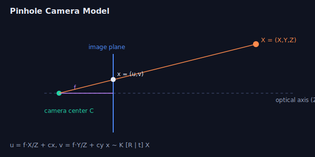

# Week 2 — 3D Geometry & Rigid-Body Transforms

> Every robot question eventually becomes: *"what frame is this in, and how do I
> get it into the frame I care about?"* Master rotations and SE(3) and half of
> perception bookkeeping disappears.

---

## 1. Rotations — the group SO(3)

A rotation matrix `R` is 3×3 with:
- `RᵀR = I` (orthonormal columns), and
- `det(R) = +1` (right-handed, not a reflection).

It has **3 degrees of freedom** despite 9 entries (6 constraints). Columns of `R`
are the axes of the rotated frame expressed in the original frame.

### Representations & trade-offs

| Representation | DoF stored | Pros | Cons |
|---|---|---|---|
| Rotation matrix | 9 | composes by matmul, no ambiguity | redundant, drifts off SO(3) |
| Euler angles (roll/pitch/yaw) | 3 | intuitive, minimal | **gimbal lock**, order-dependent |
| Axis-angle (`θ·k̂`) | 3 | minimal, used in optimization | singular at θ=0 handling |
| Quaternion (`q = [w,x,y,z]`) | 4 | no gimbal lock, smooth slerp, cheap | unit-norm constraint, double cover (`q` ≡ `−q`) |

**Gimbal lock:** when two Euler axes align (e.g. pitch = 90°), you lose a DoF.
This is why state estimators and IMUs use quaternions internally.

---

## 2. The exponential map (axis-angle ↔ matrix)

Rotation by angle `θ` about unit axis `k̂` (Rodrigues' formula):

```
R = I + sinθ [k̂]ₓ + (1 − cosθ) [k̂]ₓ²
```

- `exp: so(3) → SO(3)` turns a 3-vector `ω = θk̂` (the **Lie algebra**) into a
  rotation matrix.
- `log: SO(3) → so(3)` goes back. These let you do calculus on rotations — the
  basis for optimizing over poses (you perturb in the tangent space `Δ ∈ ℝ³`).

> Interview gold: *"How do you optimize over rotations without breaking
> orthonormality?"* → parameterize updates in the tangent space (Lie algebra) and
> apply via the exponential map: `R ← R · exp([Δ]ₓ)`.

---

## 3. Quaternions in practice

- Unit quaternion `q = w + xi + yj + zk`, `‖q‖ = 1`.
- **Composition** of rotations = quaternion multiplication (Hamilton product).
- **Rotate a vector:** `v' = q v q⁻¹`.
- **SLERP** = constant-angular-velocity interpolation between orientations
  (smooth camera paths, IMU integration).
- Pitfalls: normalize after updates; pick a hemisphere (`q` vs `−q`) for
  continuity; watch Hamilton vs JPL convention (ROS uses Hamilton, `[x,y,z,w]`
  ordering in messages!).

---

## 4. Rigid-body transforms — SE(3)

A pose = rotation + translation, stored as a 4×4 **homogeneous** matrix:

```
       [ R   t ]          point:  X̃ = [X Y Z 1]ᵀ
T  =   [ 0   1 ]          transform:  X̃' = T X̃
```

- **Compose** by matmul: `T_world_cam = T_world_body · T_body_cam`.
- **Invert:** `T⁻¹ = [Rᵀ  −Rᵀt; 0 1]`.
- Read the subscripts as a chain — `T_A_B` maps points *from frame B into frame A*.
  Adjacent subscripts must "cancel": `T_A_B · T_B_C = T_A_C`.

> Frame-naming discipline (`T_target_source`) eliminates an entire class of sign
> and ordering bugs. Use it religiously.

---

## 5. Common frames in a robot

- **World / map** — fixed global frame.
- **Body / base_link** — robot center.
- **Sensor frames** — camera, LiDAR, IMU, each with an extrinsic `T_body_sensor`
  found by **calibration**.
- **Camera optical frame** — z-forward, x-right, y-down (REP-103 differs from the
  robot's x-forward body frame — a classic gotcha).


*(Camera projection ties directly into next week — a point goes world → camera via
`T_cam_world`, then camera → pixels via `K`.)*

---

## Interview-style questions
1. Why do quaternions avoid gimbal lock when Euler angles don't?
2. How would you optimize a camera pose over SO(3)/SE(3) while staying on the manifold?
3. Given `T_world_cam` and a point in world coordinates, write the transform to camera coordinates.
4. What's the inverse of a homogeneous transform — derive it, don't just invert 4×4.
5. ROS gives a quaternion as `[x,y,z,w]`; another lib expects `[w,x,y,z]`. What breaks and how do you catch it?

## Resources
- *Modern Robotics* (Lynch & Park), Ch. 3 — rotations, SE(3), screws. Free PDF + Coursera.
- *State Estimation for Robotics* (Barfoot), Ch. 6–7 — Lie groups for estimation.
- Quaternion visualizer: eater.net/quaternions.

➡ **Coding:** `coding-practice/robotics/w2_rotations.py`, `w2_transform_chain.py`
