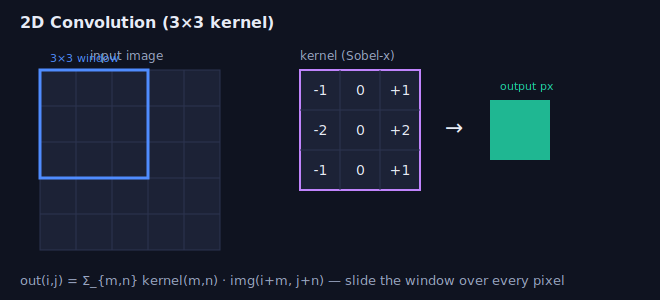

# Week 3 — Camera Models & Classical Image Processing

> How does a 3D world become a 2D array of pixels — and what can we recover from
> that array with filters before any learning is involved?

---

## 1. The pinhole camera model


A 3D point `X_cam = (X, Y, Z)` in the camera frame projects to pixel `(u, v)`:

```
u = fx · X/Z + cx
v = fy · Y/Z + cy
```

In matrix form with homogeneous coordinates:

```
        [ fx  0  cx ]
s·x =   [ 0   fy cy ] · [R | t] · X_world      x = [u v 1]ᵀ
        [ 0   0   1 ]
        \____ K ____/
```

- **K (intrinsics):** focal lengths `fx, fy` (pixels), principal point `cx, cy`,
  optional skew. Properties of the camera + lens.
- **[R | t] (extrinsics):** where the camera is in the world (= `T_cam_world`).
- The `1/Z` divide is the **projective** part — depth is lost; this is why a single
  image is ambiguous up to scale.

---

## 2. Lens distortion

Real lenses bend rays. The standard (Brown–Conrady) model:

- **Radial:** `x_d = x(1 + k1 r² + k2 r⁴ + k3 r⁶)` — barrel/pincushion.
- **Tangential:** `p1, p2` terms from lens/sensor misalignment.

You **undistort** before doing geometry (or work in normalized coordinates). For
wide-FOV/fisheye lenses use the fisheye (equidistant) model instead.

---

## 3. Camera calibration (Zhang's method)

Show the camera a planar checkerboard at several orientations:
1. Detect corners (known board geometry → known 3D, measured 2D).
2. Each view gives a homography board→image.
3. Solve linearly for `K`, then per-view `[R|t]`.
4. Refine everything + distortion by minimizing **reprojection error** (nonlinear
   least squares — your Week 1 Gauss–Newton/LM).

> Reprojection error (px) is the universal sanity metric: project known 3D points
> with your estimated params and measure pixel distance to detections. < ~0.5 px
> is typically a good calibration.

---

## 4. Image processing fundamentals

### Convolution


```
out(i,j) = Σ_{m,n} kernel(m,n) · img(i+m, j+n)
```
- **Box / Gaussian blur** — smoothing, noise reduction. Gaussian is **separable**
  (`G_2D = g_x · g_yᵀ`) → do two 1D passes, `O(2k)` instead of `O(k²)`.
- **Padding & borders** matter (zero / reflect / replicate).

### Gradients & edges
- **Sobel** approximates `∂I/∂x`, `∂I/∂y`. Gradient magnitude
  `|∇I| = √(Gx²+Gy²)` and direction `atan2(Gy, Gx)`.
- **Laplacian** = second derivative → zero-crossings at edges (blob/edge detection).
- **Canny** = gradient + non-max suppression + hysteresis thresholding → clean
  thin edges.

### Scale space & pyramids
- Repeatedly blur + downsample → **image pyramid**. Lets detectors find features at
  multiple scales and enables coarse-to-fine matching/optical flow.
- **Difference of Gaussians (DoG)** approximates the scale-normalized Laplacian →
  basis of SIFT keypoint detection (next week).

### Histograms & thresholding
- Histogram equalization for contrast; Otsu's method for automatic binary threshold.

---

## 5. Color & the basics you'll be asked

- RGB vs. grayscale vs. HSV (hue is robust to lighting for color segmentation).
- Bayer pattern / demosaicing (raw sensor → RGB).
- Image coordinates: `(row, col)` vs `(x=u, y=v)` — mixing them up is the #1 bug.

---

## Interview-style questions
1. Walk through projecting a 3D world point to a pixel, naming every matrix.
2. Why is a Gaussian blur separable and why does that matter for performance?
3. How does checkerboard calibration recover intrinsics? What's reprojection error?
4. Implement 2D convolution; what's the time complexity and how do you speed it up?
5. You see straight lines bowing outward at image edges — what's wrong and how do you fix it?
6. Difference between `fx` in pixels vs. focal length in mm?

## Resources
- Szeliski, *Computer Vision: Algorithms and Applications* — Ch. 2 (image
  formation), Ch. 3 (image processing). Free PDF.
- First Principles of Computer Vision (Shree Nayar) YouTube series.
- OpenCV calibration tutorial.

➡ **Coding:** `coding-practice/robotics/w3_convolution.py`, `w3_projection.py`
