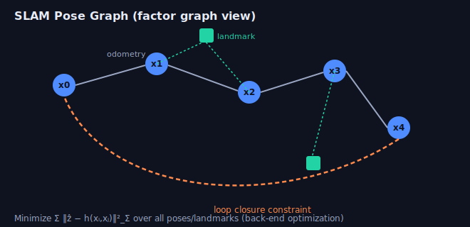

# Week 6 — SLAM, Odometry & Sensor Fusion

> SLAM = **S**imultaneous **L**ocalization **a**nd **M**apping: build a map of an
> unknown environment while tracking your pose within it. It ties together
> geometry (Week 4) and estimation (Week 5).

---

## 1. The SLAM problem & architecture

A modern SLAM system splits into:

- **Front-end** (data processing): feature extraction/tracking, data association,
  short-term motion estimation (odometry), loop-closure *detection*.
- **Back-end** (optimization): refine poses + map by minimizing error over a graph;
  apply loop closures.

The full posterior `p(x_{0:t}, m | z, u)` is intractable; we solve a MAP estimate
via nonlinear least squares (a graph), not a filter, in most modern systems.

---

## 2. Visual odometry (VO)

Estimate camera motion frame-to-frame:

**Feature-based pipeline**
1. Detect + match features (ORB/SIFT) between frames.
2. Estimate relative pose: essential matrix (mono) or PnP (with known 3D / RGB-D).
3. Triangulate new points; track them.
4. Local **bundle adjustment** over a sliding window of keyframes.

**Direct methods** (DSO, LSD-SLAM): skip features, minimize **photometric error**
directly over pixel intensities. Better in low-texture, sensitive to brightness
changes/calibration.

- Mono VO has **scale drift / unknown scale**; stereo and RGB-D give metric scale.
- VO is *odometry* (drifts over time); SLAM adds loop closure to correct drift.

---

## 3. Pose-graph optimization & loop closure



- **Nodes** = poses (and/or landmarks). **Edges** = constraints (odometry between
  consecutive poses; loop closures between revisited places).
- Each edge contributes a residual `‖ẑᵢⱼ ⊖ h(xᵢ, xⱼ)‖²_Σ`; minimize the sum with
  Gauss–Newton/LM (your Week 1 math, on the SE(3) manifold from Week 2).
- **Loop closure**: recognize a previously seen place (e.g. **bag-of-words** /
  DBoW2, or learned place recognition) → add an edge that snaps accumulated drift
  back into alignment.

**Factor graphs** (g2o, GTSAM, Ceres) are the standard tooling — variables
(poses/landmarks) connected by factors (measurements). They exploit sparsity for
efficiency.

---

## 4. LiDAR odometry & registration (ICP)

**Iterative Closest Point** aligns two point clouds:
```
repeat:
    for each point in source, find nearest point in target (kd-tree)
    estimate R, t minimizing Σ ‖ R pᵢ + t − qᵢ ‖²   (closed form via SVD)
    apply transform; check convergence
```
- **Point-to-point** vs **point-to-plane** (uses surface normals → faster, more
  accurate on structured scenes).
- Sensitive to initialization and outliers → use good init (IMU/odometry), reject
  far correspondences, downsample (voxel grid).
- Real LiDAR SLAM: LOAM / LeGO-LOAM / LIO-SAM extract edge & planar features and
  fuse IMU.

---

## 5. Visual-Inertial Odometry (VIO)

Fuse camera + IMU — complementary sensors:
- IMU: high-rate, great short-term, but **drifts** (double-integrated bias/noise).
- Camera: accurate but low-rate and scale-ambiguous (mono).
- Together: metric scale, robustness to motion blur / fast motion, gravity gives
  roll/pitch observability.

**IMU preintegration** summarizes many IMU samples between keyframes into a single
relative-motion factor (so you don't re-integrate when the linearization point
changes) — the key trick behind VINS-Mono, OKVIS, ORB-SLAM3.

- Filter-based VIO (MSCKF) vs optimization-based (VINS-Mono): EKF efficiency vs
  smoother accuracy.

---

## 6. Fusion patterns & gotchas

- **Loosely vs tightly coupled** fusion: combine independent pose estimates vs.
  jointly optimize raw measurements (tighter = more accurate, more complex).
- **Time synchronization** across sensors is critical (hardware trigger / PTP / TF
  timestamps). Bad sync looks like bad calibration.
- **Extrinsic calibration** between sensors must be known/estimated.

---

## Interview-style questions
1. Filter-based vs. optimization-based SLAM — trade-offs?
2. Why does monocular VO drift in scale and how do stereo/IMU/RGB-D fix it?
3. Walk through ICP. How do you make it robust and fast?
4. What is loop closure and why does it matter? How do you detect one?
5. Why preintegrate IMU measurements?
6. What's a factor graph and why is it the right structure for SLAM?

## Resources
- Cadena et al., *"Past, Present, and Future of SLAM"* (survey) — read once, twice.
- Cyrill Stachniss SLAM course (YouTube) — graph SLAM, ICP, factor graphs.
- ORB-SLAM3, VINS-Mono papers; GTSAM/Ceres tutorials.

➡ **Coding:** `coding-practice/robotics/w6_icp.py`, `w6_pose_graph.py`
