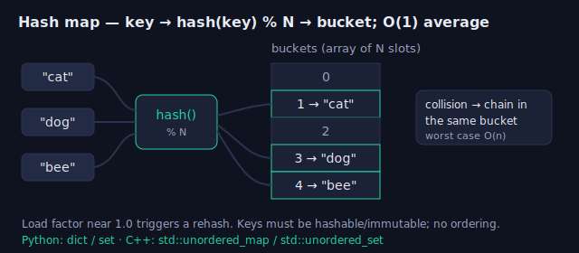
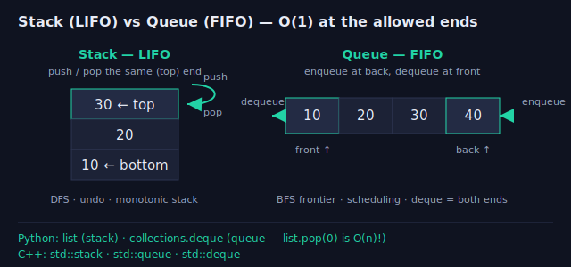
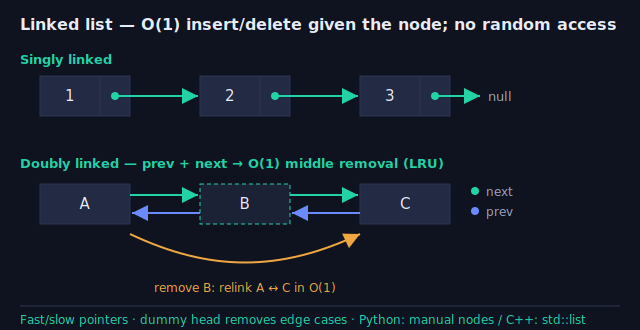
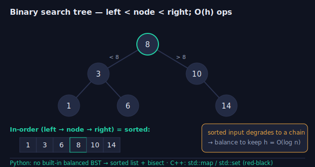
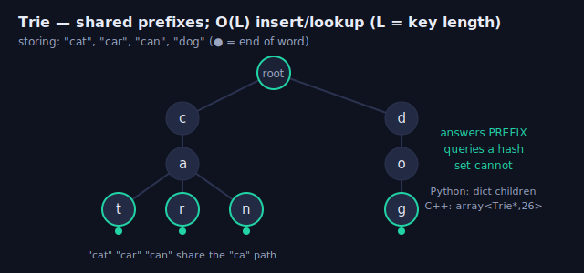

# Week 1 — Core Data Structures

> Before you can recognize a **pattern**, you have to own the **containers** the pattern
> is built from. BFS is a queue. Top-k is a heap. Autocomplete is a trie. "Sorted and
> mutable" is a balanced BST. This week is the toolbox: for each structure — the
> *invariant* it maintains, the *cost* of each operation, the *library type* that
> implements it, and the *tell* that says "reach for this one." Next week these become
> the LeetCode patterns.

---

## How to pick a structure (the decision reflex)

Ask: **which operation must be fast, and how often do I do it?** Then match the shape:

- **Lookup by key / dedup / counting** → hash map / hash set. O(1) average.
- **Order matters, add/remove at one end** → stack (LIFO) or queue (FIFO).
- **"Next greater/smaller", matching brackets, undo, expression parsing** → stack (often *monotonic*).
- **Repeatedly pull the min or max** → heap / priority queue. O(log n) per pop.
- **O(1) insert/delete in the middle *if you hold the node*** → linked list (LRU, free lists).
- **Keep keys sorted *and* mutable (insert/erase/range/successor)** → balanced BST.
- **Prefix queries over strings / autocomplete / word dictionary** → trie.
- **Relationships / reachability / shortest path** → graph (adjacency list).
- **Dynamic connectivity / "are these in the same group?"** → union-find (DSU).

> Interview reflex: name the operation and its frequency *out loud*, state the naive cost,
> then pick the structure whose invariant makes that operation cheap. The structure is the
> answer to "what am I doing repeatedly, and why is it slow?"

---

## Complexity cheat sheet

| Structure | Access | Search | Insert | Delete | Notes |
|---|---|---|---|---|---|
| Array / dynamic array | O(1) | O(n) | O(1)* end / O(n) mid | O(n) | *amortized; contiguous, cache-friendly |
| Hash map / set | — | O(1) avg | O(1) avg | O(1) avg | O(n) worst (collisions); unordered |
| Stack / queue / deque | O(1) ends | O(n) | O(1) | O(1) | LIFO / FIFO; deque = both ends |
| Binary heap | O(1) peek | O(n) | O(log n) | O(log n) | build/heapify O(n); not searchable |
| Singly / doubly linked list | O(n) | O(n) | O(1)† | O(1)† | †given the node; no random access |
| Balanced BST | O(log n) | O(log n) | O(log n) | O(log n) | in-order traversal = sorted |
| Trie | O(L) | O(L) | O(L) | O(L) | L = key length; alphabet-sized fan-out |
| Union-find (DSU) | — | ~O(α(n)) | ~O(α(n)) | — | union + find; α = inverse Ackermann |

---

## Language cheat sheet — Python ↔ C++

Interviewers expect you to reach for the *library* type, not hand-roll. Know both columns and
the gotcha in the last one — most bugs live there.

| Structure | Python | C++ (STL) | Watch out |
|---|---|---|---|
| Dynamic array | `list` | `std::vector` | `vector.reserve(n)` to avoid repeated reallocations |
| Hash map / set | `dict` / `set` | `std::unordered_map` / `unordered_set` | unordered; O(n) worst case on collisions |
| Ordered map / set | `bisect` on a sorted `list` | `std::map` / `std::set` | Python has **no** built-in balanced BST |
| Stack (LIFO) | `list` (`append`/`pop`) | `std::stack` | — |
| Queue / deque | `collections.deque` | `std::queue` / `std::deque` | `list.pop(0)` is **O(n)** — use a deque |
| Heap / PQ | `heapq` (**min**-heap) | `std::priority_queue` (**max**-heap) | opposite defaults — negate values to flip |
| Linked list | manual `Node` class | `std::list` (doubly) | rarely beats a `vector`/`list` in practice |
| Trie | `dict` of children | `array<Trie*,26>` or `unordered_map` | fixed array is faster for a lowercase alphabet |
| Union-find | `parent` / `rank` lists | `vector<int>` | path compression + union by rank |

> Every code block below has a **Python** and a **C++** tab — toggle the language on each
> solution. The two are written to be line-for-line comparable so you can see the idiom map across.

---

## Deep-dive subpages

Each structure below has its own **deep-dive subpage** with more depth than this overview — the
invariant, variants, pseudocode, and full **Python + C++** solutions (toggle the language on each).
Start here for the map; open a subpage to actually learn one structure.

| Structure | Deep-dive subpage | Covers |
|---|---|---|
| Arrays & hashing | [Open →](topic.html?c=ds&t=arrays-hashing) | dynamic arrays · hash map/set · prefix sums · O(n²)→O(n) |
| Stacks & queues | [Open →](topic.html?c=ds&t=stacks-queues) | LIFO/FIFO · monotonic stack · deque · queue-from-stacks |
| Heaps / priority queues | [Open →](topic.html?c=ds&t=heaps-priority-queues) | binary heap · heapify O(n) · top-k · streaming median |
| Linked lists | [Open →](topic.html?c=ds&t=linked-lists) | singly/doubly · dummy head · fast/slow · LRU |
| Trees | [Open →](topic.html?c=ds&t=trees) | terminology · traversals · BST · balancing · heap/trie as trees |
| Tries | [Open →](topic.html?c=ds&t=tries) | prefix tree · O(L) lookup · wildcard search · autocomplete |
| Graphs | [Open →](topic.html?c=ds&t=graphs) | adjacency list/matrix · BFS vs DFS · topological sort |
| Union-Find (DSU) | [Open →](topic.html?c=ds&t=union-find) | path compression · union by rank · dynamic connectivity |

---

## 1. Arrays, hash maps & sets



The array is contiguous memory: O(1) random access, cache-friendly, but O(n) to insert/erase
in the middle. A **dynamic array** (`list`, `vector`) doubles capacity on growth, so append is
*amortized* O(1). A **hash map** trades order for speed: O(1) average lookup/insert by hashing
the key into a bucket; worst case degrades to O(n) if everything collides, and there is no
ordering. Reach for a hash map the instant you catch yourself doing a linear scan "have I seen
this before?" — it turns O(n²) into O(n).

- `dict` / `set` in Python, `unordered_map` / `unordered_set` in C++.
- Keys must be hashable/immutable. A **load factor** near 1.0 triggers a rehash.
- Need *sorted* keys? That's not a hash map — that's a balanced BST (`std::map`) or you sort.

??? Why is `list.append` "amortized" O(1) and not just O(1)?
Most appends are O(1), but occasionally the array is full and must reallocate to a larger
block and copy all n elements — an O(n) hit. Because capacity doubles, those expensive copies
happen rarely enough that the **average** cost per append, spread over many appends, is O(1).
That's amortized analysis: worst-case single op is O(n), amortized is O(1).

---

## 2. Stack & queue (and the deque)



Both restrict *where* you add/remove, and that restriction is exactly what makes them useful.

- **Stack — LIFO.** Push/pop the same end. The call stack, undo, DFS, matching brackets,
  and the **monotonic stack** ("next greater element", largest rectangle in histogram).
- **Queue — FIFO.** Push back, pop front. The **BFS frontier**, task scheduling, rate limiting.
- **Deque — double-ended.** Push/pop *both* ends in O(1). Sliding-window maximum, ring buffers.

In Python use `collections.deque` for a queue (a plain `list.pop(0)` is O(n)!). In C++,
`std::stack`, `std::queue`, and `std::deque`.

:::solution Valid Parentheses — the canonical stack use
```python
def is_valid(s: str) -> bool:
    pairs = {')': '(', ']': '[', '}': '{'}
    stack = []
    for c in s:
        if c in pairs:                      # closing bracket
            if not stack or stack.pop() != pairs[c]:
                return False
        else:                               # opening bracket
            stack.append(c)
    return not stack                        # all matched?
```
```cpp
bool isValid(const string& s) {
    unordered_map<char,char> pairs{{')','('},{']','['},{'}','{'}};
    stack<char> st;
    for (char c : s) {
        if (pairs.count(c)) {               // closing
            if (st.empty() || st.top() != pairs[c]) return false;
            st.pop();
        } else st.push(c);                  // opening
    }
    return st.empty();
}
```
:::

??? Why is a monotonic stack O(n) even though it looks like nested loops?
Each element is **pushed once and popped once**. The inner `while` that pops smaller/larger
elements can run many times on a single step, but across the whole pass it can pop each element
at most once total. Total push+pop operations ≤ 2n, so the amortized cost is O(n), not O(n²).

---

## 3. Priority queue / binary heap


A heap keeps the **min (or max) at the root** without fully sorting. It's an array where node
`i`'s children are `2i+1` and `2i+2`, maintaining the heap invariant *parent ≤ children*
(min-heap). `push` and `pop` are O(log n) (sift up/down); `peek` is O(1). Building from an
existing array is O(n) via `heapify` — cheaper than n inserts.

Reach for a heap on: **top-k**, **k-th largest**, **merge k sorted lists**, **streaming median**
(two heaps), **Dijkstra / Prim**, and any "always process the smallest/largest remaining next."

- Python `heapq` is a **min-heap** on a list; push negatives for a max-heap.
- C++ `std::priority_queue` is a **max-heap** by default; pass `greater<>` for a min-heap.

:::solution K-th largest with a size-k min-heap — O(n log k)
```python
import heapq

def kth_largest(nums, k):
    heap = nums[:k]
    heapq.heapify(heap)                     # O(k)
    for x in nums[k:]:
        if x > heap[0]:                     # bigger than current k-th largest?
            heapq.heapreplace(heap, x)      # pop min, push x — O(log k)
    return heap[0]                          # root = k-th largest
```
```cpp
int kthLargest(vector<int>& nums, int k) {
    priority_queue<int, vector<int>, greater<int>> heap;   // min-heap of size k
    for (int x : nums) {
        heap.push(x);
        if ((int)heap.size() > k) heap.pop();              // drop the smallest
    }
    return heap.top();                                     // k-th largest
}
```
:::

??? Top-k: why a size-k heap (O(n log k)) instead of sorting (O(n log n))?
When k ≪ n, keeping only k elements makes each heap op O(log k) instead of O(log n), and you
never materialize a full sort. Sorting is simpler and fine when k is close to n or you also need
the elements ordered — but for "the 10 largest out of a million," the heap wins on both time and
memory.

---

## 4. Linked lists



Nodes connected by pointers. No random access (O(n) to reach index i), but **O(1) insert/delete
once you hold the node** — no shifting. A **doubly linked list** also has `prev`, enabling O(1)
removal from the middle, which is why an **LRU cache** pairs a hash map (O(1) find the node)
with a doubly linked list (O(1) move-to-front / evict-tail).

Interview staples: reverse a list, detect a cycle (Floyd's **fast/slow pointers**), find the
middle, merge two sorted lists. The **dummy head** node removes edge cases around the head.

:::solution Reverse a singly linked list — iterative, O(n)/O(1)
```python
def reverse_list(head):
    prev = None
    while head:
        nxt = head.next     # save next
        head.next = prev    # flip the pointer
        prev = head         # advance prev
        head = nxt          # advance head
    return prev             # new head
```
```cpp
ListNode* reverseList(ListNode* head) {
    ListNode* prev = nullptr;
    while (head) {
        ListNode* nxt = head->next;   // save next
        head->next = prev;            // flip
        prev = head;                  // advance
        head = nxt;
    }
    return prev;                      // new head
}
```
:::

??? When is a linked list actually better than a dynamic array?
When you do many **insertions/deletions in the middle and already hold a pointer to the spot**
(LRU eviction, free lists, splicing) — O(1) vs O(n) shifting. In practice arrays usually win
anyway because contiguous memory is cache-friendly and pointer-chasing thrashes the cache. Prefer
`vector`/`list` unless you specifically need O(1) splice with a held node.

---

## 5. Binary search trees



A BST maintains the **ordering invariant**: for every node, all keys in the left subtree are
smaller and all keys in the right are larger. That single rule gives O(h) search/insert/delete
where h is the height, and an **in-order traversal visits keys in sorted order**. The catch:
if you insert sorted data into a naive BST it degenerates into a linked list (h = n, O(n) ops).
**Self-balancing** trees (red-black, AVL) keep h = O(log n) — this is what backs `std::map` /
`std::set` and Java's `TreeMap`.

Reach for a BST-backed ordered map when you need keys **sorted *and* mutable**: range queries,
successor/predecessor, "floor/ceiling of x", or a sorted structure you insert into and erase from.

:::solution Validate a BST — bounds passed down, O(n)
```python
def is_valid_bst(root):
    def ok(node, lo, hi):
        if not node:
            return True
        if not (lo < node.val < hi):        # violates the invariant
            return False
        return ok(node.left, lo, node.val) and ok(node.right, node.val, hi)
    return ok(root, float('-inf'), float('inf'))
```
```cpp
bool ok(TreeNode* n, long lo, long hi) {
    if (!n) return true;
    if (!(lo < n->val && n->val < hi)) return false;
    return ok(n->left, lo, n->val) && ok(n->right, n->val, hi);
}
bool isValidBST(TreeNode* root) { return ok(root, LONG_MIN, LONG_MAX); }
```
:::

??? Why must a BST be *balanced* to be useful, and how do you get sorted output from one?
Operations are O(height). A balanced tree keeps height at O(log n); an unbalanced one (e.g. from
inserting already-sorted keys) degrades to a chain of height n, making everything O(n) — no better
than a list. **In-order traversal** (left → node → right) visits keys in ascending order, which is
also how you'd find the k-th smallest: stop after k in-order visits.

---

## 6. Tries (prefix trees)



A trie stores strings by **sharing prefixes**: each node is one character, and a path from the
root spells a prefix. Insert and lookup are **O(L)** in the key length L — independent of how many
words are stored — because you walk one character at a time. A boolean `is_end` marks complete
words. This is the structure behind **autocomplete**, spell-checkers, IP routing, and "does any
word start with this prefix?" queries that a hash map can't answer efficiently.

:::solution Implement a trie — insert / search / startsWith
```python
class Trie:
    def __init__(self):
        self.children = {}          # char -> Trie
        self.is_end = False

    def insert(self, word):
        node = self
        for c in word:
            node = node.children.setdefault(c, Trie())
        node.is_end = True

    def _find(self, prefix):
        node = self
        for c in prefix:
            if c not in node.children:
                return None
            node = node.children[c]
        return node

    def search(self, word):
        node = self._find(word)
        return node is not None and node.is_end

    def starts_with(self, prefix):
        return self._find(prefix) is not None
```
```cpp
struct Trie {
    array<Trie*, 26> child{};   // 'a'..'z'
    bool isEnd = false;

    void insert(const string& w) {
        Trie* node = this;
        for (char c : w) {
            int i = c - 'a';
            if (!node->child[i]) node->child[i] = new Trie();
            node = node->child[i];
        }
        node->isEnd = true;
    }
    Trie* find(const string& p) {
        Trie* node = this;
        for (char c : p) {
            int i = c - 'a';
            if (!node->child[i]) return nullptr;
            node = node->child[i];
        }
        return node;
    }
    bool search(const string& w) { Trie* n = find(w); return n && n->isEnd; }
    bool startsWith(const string& p) { return find(p) != nullptr; }
};
```
:::

??? A hash set of words gives O(1) lookup — why ever use a trie?
A hash set answers "is this *exact* word present?" but not "does any word start with `pre`?"
without scanning every key. A trie answers **prefix** queries in O(L), enumerates all completions
of a prefix, and shares memory across common prefixes. Use a hash set for exact membership; a trie
when prefixes matter (autocomplete, wildcard `.` matching, longest-prefix routing).

---

## 7. Graphs & union-find

A **graph** is nodes + edges, stored as an **adjacency list** (`dict[node] -> list of neighbors`,
O(V+E) space — the default) or an **adjacency matrix** (O(V²), only for dense graphs or O(1) edge
tests). It's the substrate for next week's BFS/DFS/Dijkstra — here just know how to *build and
represent* it.


**Union-find (disjoint-set union)** tracks which elements are in the same group, with two ops:
`find(x)` (which set?) and `union(a, b)` (merge). With **path compression** + **union by rank**,
both are ~O(α(n)) — effectively constant. It's the go-to for **dynamic connectivity**, cycle
detection in an undirected graph, and Kruskal's MST.

:::solution Union-find with path compression + union by rank
```python
class DSU:
    def __init__(self, n):
        self.parent = list(range(n))
        self.rank = [0] * n

    def find(self, x):
        while self.parent[x] != x:
            self.parent[x] = self.parent[self.parent[x]]  # path compression
            x = self.parent[x]
        return x

    def union(self, a, b):
        ra, rb = self.find(a), self.find(b)
        if ra == rb:
            return False                     # already connected (a cycle if undirected)
        if self.rank[ra] < self.rank[rb]:
            ra, rb = rb, ra
        self.parent[rb] = ra
        if self.rank[ra] == self.rank[rb]:
            self.rank[ra] += 1
        return True
```
```cpp
struct DSU {
    vector<int> parent, rank_;
    DSU(int n) : parent(n), rank_(n, 0) { iota(parent.begin(), parent.end(), 0); }
    int find(int x) {
        while (parent[x] != x) { parent[x] = parent[parent[x]]; x = parent[x]; }
        return x;
    }
    bool unite(int a, int b) {
        int ra = find(a), rb = find(b);
        if (ra == rb) return false;
        if (rank_[ra] < rank_[rb]) swap(ra, rb);
        parent[rb] = ra;
        if (rank_[ra] == rank_[rb]) rank_[ra]++;
        return true;
    }
};
```
:::

??? Union-find vs. BFS/DFS for connectivity — when does each win?
Use **BFS/DFS** when the graph is fixed and you want to explore it once (components, paths,
distances). Use **union-find** when connectivity is **dynamic** — edges arrive over time and you
repeatedly ask "are a and b connected yet?" — because it answers each query in ~O(1) without
re-traversing. It also detects cycles as you add edges (a `union` that finds both ends already in
the same set = a cycle).

---

## Putting it together — the interview checklist

1. **Name the operation you repeat** (lookup? pull-min? prefix query? merge groups?).
2. **Match it to the structure** whose invariant makes that op cheap (the decision list up top).
3. **State the complexity** of every op you'll use, and the total.
4. **Know the library type** so you don't hand-roll: `dict`/`unordered_map`, `deque`,
   `heapq`/`priority_queue`, `std::map`/`std::set`, and a trie/DSU you can write in ~15 lines.
5. Watch the **gotchas**: `list.pop(0)` is O(n) (use a deque); Python `heapq` is min-only;
   a naive BST degrades on sorted input; hash maps have no order.

> Next week (LeetCode Patterns) these structures *become* the patterns: the BFS queue, the top-k
> heap, the union-find grouping, the monotonic stack. Own the containers now and the patterns
> read as "which structure, applied how."
