# Week 1 — LeetCode Patterns & Core Techniques

> You don't memorize problems — you recognize **patterns**. Almost every coding-round
> question is one of a dozen techniques wearing a costume. This week is the cheat lsheet:
> when to reach for two pointers vs. a hash map, BFS vs. DFS, divide-and-conquer vs.
> dynamic programming — plus a reusable code template and the complexity for each.

---

## 0. How to pick a technique (the decision reflex)

When you read a problem, map its *shape* to a pattern before writing code:

- **Sorted array / pair-sum / in-place dedup** → two pointers.
- **Contiguous subarray / substring with a constraint** → sliding window.
- **Shortest path / level-by-level / "minimum steps"** → BFS.
- **Reachability / connected components / all paths / cycles** → DFS.
- **"Sorted" + "find / smallest / search on answer"** → binary search.
- **"Split in half, combine"** (sort, count, merge) → divide and conquer.
- **Overlapping subproblems + optimal substructure** ("max/min/count ways") → DP.
- **"All combinations / permutations / subsets"** → backtracking.
- **"k largest / smallest / running median / merge k"** → heap.
- **Dynamic connectivity / grouping** → union-find.
- **"Next greater/smaller element", matching brackets, expression parsing, undo** → stack (monotonic stack).
- **"Locally optimal = globally optimal" (intervals, scheduling)** → greedy.

> Interview reflex: say the **brute force + its complexity out loud first**, name the
> bottleneck, then pick the pattern that removes it. The pattern is the answer to
> "what is too slow and why."

---

## 1. Two pointers

Two indices walking an array — toward each other (pair problems on **sorted** data) or
in the same direction (fast/slow, in-place writes). Turns many `O(n²)` scans into `O(n)`.

**Use when:** sorted array, pair/triple sums, palindrome checks, removing duplicates,
partitioning, or merging two sorted sequences.

**🎯 Drill (in-site):** [3Sum](practice.html?p=3sum) — sort, then for each `i` run a
two-pointer scan on the rest; the most-asked two-pointer question.

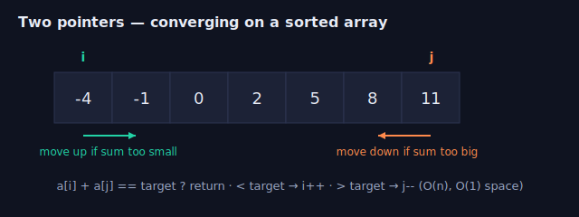

**Pseudocode (template):**

```text
function twoPointers(a):              # a is sorted
    i ← 0;  j ← length(a) − 1
    while i < j:
        if condition(a[i], a[j]) holds:
            record / return (i, j)
            i ← i + 1;  j ← j − 1      # move both inward
        else if need a larger value:
            i ← i + 1                 # advance the small end
        else:                          # need a smaller value
            j ← j − 1                 # retreat the big end
```

```python
# Pair that sums to target in a SORTED array — O(n) time, O(1) space
def two_sum_sorted(a, target):
    i, j = 0, len(a) - 1
    while i < j:
        s = a[i] + a[j]
        if s == target:   return (i, j)
        elif s < target:  i += 1      # need bigger → move left pointer up
        else:             j -= 1      # need smaller → move right pointer down
    return None
```

The **fast/slow** variant (in-place compaction, cycle detection in a linked list) keeps a
`write` pointer behind a `read` pointer. Cycle detection (Floyd's) advances slow by 1,
fast by 2; they meet iff there's a cycle.

---

## 2. Sliding window

A two-pointer specialization for **contiguous** subarrays/substrings. Grow the window
from the right; when it violates a constraint, shrink from the left. Each element enters
and leaves at most once → **O(n)**.

**Use when:** "longest/shortest/at-most-k subarray," moving averages over a stream,
"smallest window containing …".

**🎯 Drill (in-site):** [Longest Substring Without Repeating Characters](practice.html?p=longest-substring-no-repeat)
— grow right, jump `left` past the last duplicate; the canonical variable-window question.

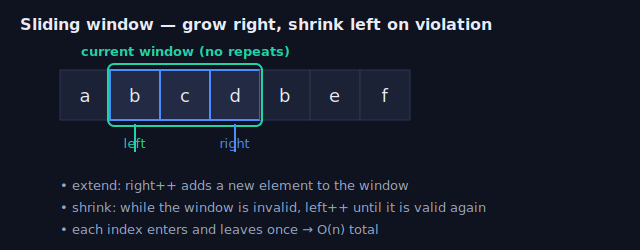

**Pseudocode (template):**

```text
function slidingWindow(seq):
    left ← 0
    for right in 0 … length(seq) − 1:
        add seq[right] to the window
        while window is invalid:          # constraint broken
            remove seq[left] from window
            left ← left + 1
        update answer with (right − left + 1)
    return answer
```

```python
# Longest substring without repeating characters — O(n)
def longest_unique(s):
    seen = {}            # char -> last index
    left = best = 0
    for right, c in enumerate(s):
        if c in seen and seen[c] >= left:
            left = seen[c] + 1        # jump left past the previous occurrence
        seen[c] = right
        best = max(best, right - left + 1)
    return best
```

For **fixed-size** windows (moving average, sliding-window max), add the entering element
and pop the leaving one — a deque gives O(1) amortized max/min over the window.

---

## 3. BFS — breadth-first search

Explore level by level with a **queue**. On an **unweighted** graph/grid, the first time
you reach a node is via a **shortest path** (fewest edges). That's the whole reason BFS
exists.

**Use when:** shortest path / minimum number of steps on an unweighted graph, level-order
traversal, "spread from multiple sources" (multi-source BFS), grid flood fill where you
need distance.

**🎯 Drill (in-site):** [Rotting Oranges](practice.html?p=rotting-oranges) — seed the
queue with *all* rotten cells at once (multi-source BFS) and count the levels; the
most-asked grid-BFS question.

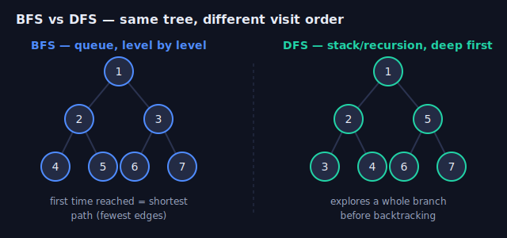

**Pseudocode (template):**

```text
function bfs(start):
    queue ← [start];  seen ← {start};  dist ← 0
    while queue not empty:
        for each node in the current level:   # fixed-size sweep
            pop node
            if node is goal: return dist
            for nb in neighbors(node):
                if nb not in seen:
                    seen.add(nb)              # mark on ENQUEUE, not dequeue
                    queue.push(nb)
        dist ← dist + 1
    return -1                                 # unreachable
```

```python
from collections import deque

def bfs_shortest(grid, start, goal):
    R, C = len(grid), len(grid[0])
    q = deque([(start, 0)])             # (cell, distance)
    seen = {start}
    while q:
        (r, c), d = q.popleft()
        if (r, c) == goal: return d
        for dr, dc in ((1,0),(-1,0),(0,1),(0,-1)):
            nr, nc = r+dr, c+dc
            if 0 <= nr < R and 0 <= nc < C and grid[nr][nc] == 0 and (nr,nc) not in seen:
                seen.add((nr, nc))      # mark on ENQUEUE, never on dequeue, to avoid dups
                q.append(((nr, nc), d+1))
    return -1
```

Weighted edges break BFS's shortest-path guarantee → use **Dijkstra** (a heap-ordered
BFS). 0/1 weights → **0-1 BFS** with a deque.

---

## 4. DFS — depth-first search

Go as deep as possible, then backtrack — naturally **recursive** (or an explicit stack).
DFS doesn't find shortest paths, but it's the tool for **reachability, connected
components, cycle detection, topological sort, and enumerating all paths**.

**🎯 Drill (in-site):** [Course Schedule II](practice.html?p=course-schedule-ii) — DFS
post-order (or Kahn's algorithm) to produce a topological order; a back-edge means a cycle.
([Clone Graph](https://leetcode.com/problems/clone-graph/) is the other classic, but isn't
stdin/stdout-judgeable.)

See the **DFS** side of the diagram above for the depth-first visit order.

**Pseudocode (template):**

```text
function dfs(node):
    if node is invalid or already visited: return
    mark node visited
    ... pre-order work (e.g. count, record path) ...
    for nb in neighbors(node):
        dfs(nb)
    ... post-order work ...               # topological order = post-order reversed
```

```python
# Count connected components / islands in a grid — O(R*C)
def num_islands(grid):
    R, C = len(grid), len(grid[0])
    seen = set()
    def dfs(r, c):
        if not (0 <= r < R and 0 <= c < C) or grid[r][c] != '1' or (r,c) in seen:
            return
        seen.add((r, c))
        for dr, dc in ((1,0),(-1,0),(0,1),(0,-1)):
            dfs(r+dr, c+dc)
    count = 0
    for r in range(R):
        for c in range(C):
            if grid[r][c] == '1' and (r,c) not in seen:
                dfs(r, c); count += 1
    return count
```

**Topological sort** (course scheduling, build/dependency order) is DFS on a DAG, pushing
each node *after* its descendants (post-order) and reversing — or Kahn's algorithm (BFS on
in-degrees). A back-edge during DFS = a **cycle** (so the schedule is impossible).

> **BFS vs. DFS in one line:** need the *shortest* / *fewest steps* → BFS. Need
> *existence / all of them / ordering* → DFS. Both are O(V+E); BFS uses O(width) memory,
> DFS uses O(depth) (watch recursion limits — go iterative for deep grids).

---

## 5. Binary search

Halve the search space each step → **O(log n)**. Beyond "find x in a sorted array," the
real power is **binary search on the answer**: if you can cheaply test "is a candidate
answer feasible?", binary-search the smallest/largest feasible value.

**🎯 Drill (in-site):** [Search in Rotated Sorted Array](practice.html?p=search-in-rotated-sorted-array)
— at each step one half is sorted; decide which half holds the target. Then try
[Koko Eating Bananas](https://leetcode.com/problems/koko-eating-bananas/) for search-on-answer.

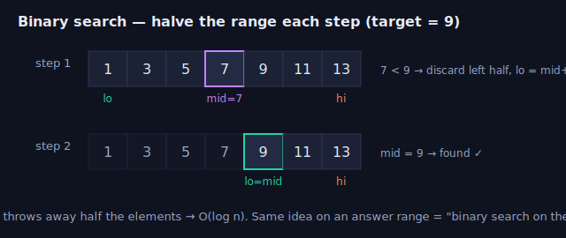

**Pseudocode (template):**

```text
function binarySearch(lo, hi):            # a sorted index range, or an answer range
    while lo < hi:
        mid ← lo + (hi − lo) / 2          # floor; avoids overflow
        if feasible(mid):                 # predicate must be monotonic
            hi ← mid                      # keep mid, search the left half
        else:
            lo ← mid + 1                  # discard mid and everything left
    return lo                             # smallest feasible value
```

```python
# Smallest index where a[i] >= target (lower_bound). Get the half-open invariant right.
def lower_bound(a, target):
    lo, hi = 0, len(a)               # search range [lo, hi)
    while lo < hi:
        mid = (lo + hi) // 2          # // is floor; no overflow worries in Python
        if a[mid] < target: lo = mid + 1
        else:               hi = mid
    return lo                         # in [0, len(a)]
```

**Search-on-answer pattern:** "minimum capacity to ship in D days," "smallest divisor,"
"split array largest sum." Write `feasible(x)`, then binary-search x. The monotonicity
(`feasible` flips false→true exactly once) is what licenses it.

---

## 6. Divide and conquer

Split into independent subproblems, solve recursively, **combine**. Cost follows the
Master theorem `T(n) = a·T(n/b) + O(combine)`.

**Use when:** merge sort / quickselect, "count while you merge" (inversions), maximum
subarray by halves, building balanced trees, closest pair of points.

**🎯 Drill (in-site):** [Merge k Sorted Lists](practice.html?p=merge-k-sorted-lists)
— pair up lists and merge halves recursively (O(N log k)); the most-asked D&C question
(a heap also works).

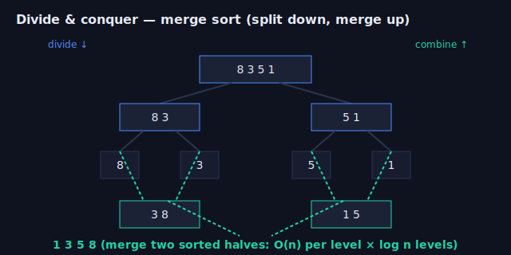

**Pseudocode (template):**

```text
function solve(problem):
    if problem is small: return baseCase(problem)
    parts   ← split(problem)               # divide
    results ← [ solve(p) for p in parts ]  # conquer
    return combine(results)                # the merge step does the real work
```

```python
def merge_sort(a):
    if len(a) <= 1: return a
    mid = len(a) // 2
    L, R = merge_sort(a[:mid]), merge_sort(a[mid:])   # divide + conquer
    out, i, j = [], 0, 0                                # combine: merge two sorted halves
    while i < len(L) and j < len(R):
        if L[i] <= R[j]: out.append(L[i]); i += 1
        else:            out.append(R[j]); j += 1
    out.extend(L[i:]); out.extend(R[j:])
    return out                                          # O(n log n), stable
```

**Quickselect** (kth-smallest in average O(n)) is divide-and-conquer that recurses into
*only one* side. The line between D&C and DP: D&C subproblems **don't overlap**; when they
*do*, you memoize and it becomes DP.

---

## 7. Dynamic programming

When subproblems **overlap** and the problem has **optimal substructure** (the optimum is
built from optima of subproblems), cache results. Two equivalent styles:

- **Top-down (memoization):** recursion + a cache. Easiest to derive — write the brute-force
  recurrence, then `@lru_cache` it.
- **Bottom-up (tabulation):** fill a table in dependency order. Lets you shrink memory
  (often to O(1) rows).

**🎯 Drill (in-site):** [Coin Change](practice.html?p=coin-change) (below) — the
canonical unbounded-knapsack DP; then [House Robber](https://leetcode.com/problems/house-robber/)
and [Longest Increasing Subsequence](https://leetcode.com/problems/longest-increasing-subsequence/).

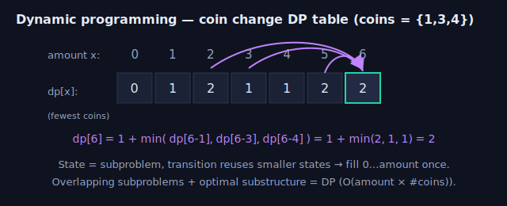

**Pseudocode (template, bottom-up):**

```text
define dp[state] = answer to the subproblem `state`
set base cases
for state in dependency order:
    dp[state] ← aggregate over choices:        # min / max / count / OR
        combine( dp[smaller_state], cost(choice) )
return dp[target]
```

```python
# Coin change: fewest coins to make `amount` — classic 1-D DP, O(amount * #coins)
def coin_change(coins, amount):
    INF = amount + 1
    dp = [0] + [INF] * amount         # dp[x] = fewest coins to make x
    for x in range(1, amount + 1):
        for c in coins:
            if c <= x:
                dp[x] = min(dp[x], dp[x - c] + 1)
    return dp[amount] if dp[amount] != INF else -1
```

**How to derive any DP:** (1) define the state (what does `dp[i]` *mean*?), (2) write the
transition (how does it build from smaller states?), (3) set base cases, (4) decide the
fill order. Common families: 1-D sequences (house robber, climbing stairs), **Kadane's**
(max subarray — running best ending here), 2-D grids (edit distance, LCS, **maximal
square**), knapsack (subset sum), and intervals (matrix-chain, burst balloons).

> **D&C vs. DP vs. greedy:** independent subproblems → D&C. Overlapping subproblems →
> DP. Locally optimal choice provably gives the global optimum → greedy (and you should be
> able to argue *why* the greedy choice is safe — usually an exchange argument).

---

## 8. Backtracking

DFS over a tree of partial solutions: **choose → explore → un-choose**. Prune branches
that can't lead to a valid/better answer. Exponential in the worst case, but pruning makes
it practical.

**Use when:** generate all subsets/permutations/combinations, N-queens, Sudoku, word
search, partitioning.

**🎯 Drill (in-site):** [Subsets](practice.html?p=subsets) (below) — the cleanest
choose/explore/un-choose template; then [Combination Sum](https://leetcode.com/problems/combination-sum/)
and [Word Search](https://leetcode.com/problems/word-search/).

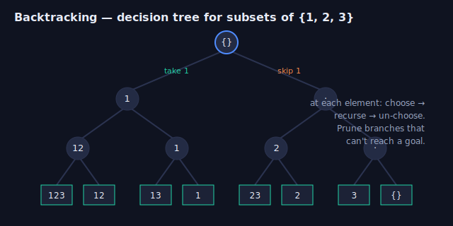

**Pseudocode (template):**

```text
function backtrack(partial):
    if partial is a complete solution:
        record(partial); return
    for choice in choices(partial):
        if not promising(choice): continue    # prune dead branches early
        apply(choice)                          # choose
        backtrack(partial + choice)            # explore
        undo(choice)                           # un-choose
```

```python
def subsets(nums):
    res, path = [], []
    def backtrack(start):
        res.append(path[:])              # every node is a valid subset
        for i in range(start, len(nums)):
            path.append(nums[i])          # choose
            backtrack(i + 1)              # explore (i+1 → no reuse; i → allow reuse)
            path.pop()                    # un-choose
    backtrack(0)
    return res
```

---

## 9. Heaps & union-find (two more you'll reach for)

**Heap (priority queue):** O(log n) push/pop of the min (or max). Use for **top-k**,
**merge k sorted lists**, **running median** (two heaps), and Dijkstra/Prim. In Python,
`heapq` is a min-heap; push negatives for a max-heap.

**🎯 Drill (in-site):** [Top K Frequent Elements](practice.html?p=top-k-frequent)
— count, then keep a size-k heap (O(n log k)); the most-asked top-k question.

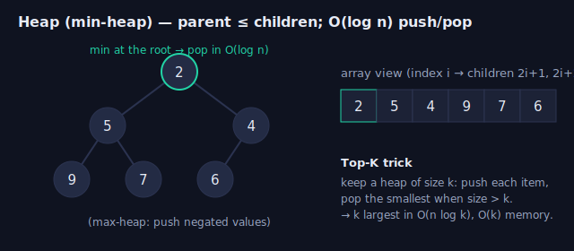

**Pseudocode (top-k with a heap):**

```text
function topK(items, k):
    heap ← empty min-heap
    for x in items:
        heap.push(x)
        if heap.size > k:
            heap.pop()            # drop the smallest → heap keeps the k largest
    return heap                   # O(n log k) time, O(k) space
```

**Union-find (disjoint set union):** near-O(1) `union`/`find` with path compression +
union by rank. Use for **dynamic connectivity**, counting components, cycle detection in an
**undirected** graph, and Kruskal's MST.

**🎯 Drill (in-site):** [Number of Provinces](practice.html?p=number-of-provinces) —
union every connected pair, then count distinct roots; then [Redundant Connection](https://leetcode.com/problems/redundant-connection/)
(the edge whose `union` returns false closes a cycle).

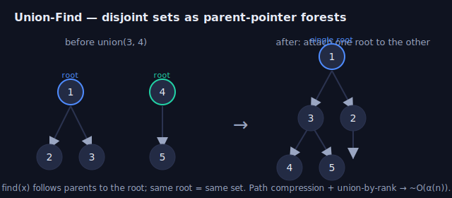

**Pseudocode (template):**

```text
parent[i] ← i for every i
function find(x):
    while parent[x] ≠ x:
        parent[x] ← parent[parent[x]]    # path compression
        x ← parent[x]
    return x
function union(a, b):
    ra ← find(a);  rb ← find(b)
    if ra == rb: return false            # same set → this edge closes a cycle
    parent[rb] ← ra                      # (attach smaller rank under larger)
    return true
```

```python
class DSU:
    def __init__(self, n): self.p = list(range(n)); self.r = [0]*n
    def find(self, x):
        while self.p[x] != x:
            self.p[x] = self.p[self.p[x]]   # path compression (halving)
            x = self.p[x]
        return x
    def union(self, a, b):
        ra, rb = self.find(a), self.find(b)
        if ra == rb: return False           # already connected → would form a cycle
        if self.r[ra] < self.r[rb]: ra, rb = rb, ra
        self.p[rb] = ra
        if self.r[ra] == self.r[rb]: self.r[ra] += 1
        return True
```

---

## 10. Stack & monotonic stack

A **stack** is a LIFO ("last in, first out") container: you only ever touch the **top**.
`push`, `pop`, `peek`, `isEmpty`, and `size` are all **O(1)**. In Python a plain list *is* a
stack — `append` to push, `pop()` to pop, `a[-1]` to peek. Reach for it whenever the
**most recent** unresolved thing is the one you need next: matching brackets, undo/redo,
DFS's explicit frontier, expression evaluation, or "what happened just before this."

**Use when:** balanced-brackets / nesting validation, evaluating or parsing expressions
(RPN, calculators), backtracking an explicit call stack, or the **next greater/smaller
element** family (that's the monotonic-stack special case below).

**🎯 Drill (in-site):** [Sliding Window Maximum](practice.html?p=sliding-window-maximum)
— the monotonic-**deque** cousin of the monotonic stack (pop smaller values off the back
before pushing, so the front is always the window max); then drill the two canonical stack
questions [Valid Parentheses](https://leetcode.com/problems/valid-parentheses/) and
[Daily Temperatures](https://leetcode.com/problems/daily-temperatures/) on leetcode.com.

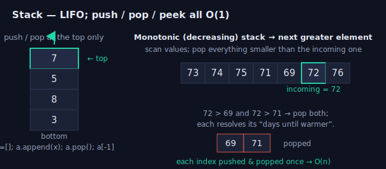

**Pseudocode — balanced brackets (the "match the most recent open" reflex):**

```text
function isBalanced(s):
    stack ← empty
    pairs ← { ')':'(', ']':'[', '}':'{' }
    for ch in s:
        if ch is an opening bracket:
            stack.push(ch)
        else:                                 # closing bracket
            if stack empty or stack.pop() ≠ pairs[ch]:
                return false                  # mismatch or nothing to close
    return stack is empty                     # nothing left dangling
```

```python
# Valid Parentheses — O(n) time, O(n) space
def is_valid(s):
    pairs = {")": "(", "]": "[", "}": "{"}
    stack = []
    for ch in s:
        if ch not in pairs:
            stack.append(ch)                  # opening → push
        elif not stack or stack.pop() != pairs[ch]:
            return False                      # closing with wrong/absent match
    return not stack                          # all opens were closed
```

### Monotonic stack — the "next greater/smaller element" pattern

Keep the stack's values in sorted (increasing *or* decreasing) order by **popping violators
before you push**. Each index is pushed and popped **at most once → O(n)** for a whole class
of problems that look `O(n²)`. Store **indices** (not just values) when you need distances.

**Reflex:** "for each element, find the nearest larger/smaller one to its left/right" →
monotonic stack. A **decreasing** stack finds *next greater*; an **increasing** stack finds
*next smaller*.

```text
function nextGreater(a):                       # decreasing monotonic stack of indices
    res ← array of 0s, size len(a)
    stack ← empty
    for i, x in enumerate(a):
        while stack not empty and a[stack.top] < x:
            j ← stack.pop()
            res[j] ← i − j                     # x at i is j's next-greater
        stack.push(i)
    return res                                 # unresolved indices keep their 0
```

```python
# Daily Temperatures: days until a warmer temperature — O(n)
def daily_temperatures(temps):
    res = [0] * len(temps)
    stack = []                                 # indices, temps decreasing down the stack
    for i, t in enumerate(temps):
        while stack and temps[stack[-1]] < t:
            j = stack.pop()
            res[j] = i - j                     # i is the first warmer day for day j
        stack.append(i)
    return res
```

Same skeleton powers **Next Greater Element**, **Largest Rectangle in Histogram**,
**Trapping Rain Water**, and stock-span problems — swap the comparison and what you record on
each pop. A companion trick is the **two-stack** idea (a *data* stack plus an *auxiliary*
stack of running minima) that gives **Min Stack**: O(1) `push`/`pop`/`top`/`getMin`.

---

## 11. Greedy

Make the **locally optimal choice** at each step and never reconsider it. Fast (usually one
pass) — but only **correct when the greedy choice is provably part of some global optimum**.
If you can't argue that, fall back to DP.

**Use when:** interval scheduling (earliest finish time), "reach the end / minimum jumps,"
Huffman coding, assigning/partitioning where an exchange argument holds.

**🎯 Drill (in-site):** [Jump Game](practice.html?p=jump-game) — track the farthest index
still reachable in one pass; then [Gas Station](https://leetcode.com/problems/gas-station/).

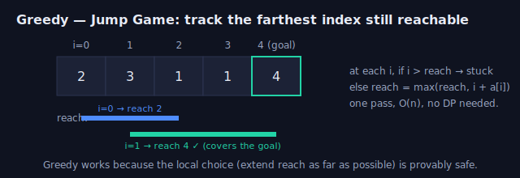

**Pseudocode (template):**

```text
function greedy(items):
    sort / order items by the greedy key      # e.g. earliest finish, smallest cost
    answer ← initial
    for item in items:
        if item is compatible with the choices so far:
            take item; update answer           # commit, never undo
    return answer
```

> Proving it: assume an optimal solution differs from the greedy one, then **exchange** the
> first differing choice for the greedy choice without making the solution worse — so a
> greedy-consistent optimum exists.

---

## 12. Complexity cheat sheet

| Pattern | Typical time | Space | Tell-tale phrasing |
|---|---|---|---|
| Two pointers | O(n) | O(1) | "sorted", "pair/triplet", "in place" |
| Sliding window | O(n) | O(k) | "contiguous", "longest/shortest subarray" |
| BFS | O(V+E) | O(width) | "shortest", "fewest steps", "level" |
| DFS | O(V+E) | O(depth) | "reachable", "all paths", "components", "cycle" |
| Binary search | O(log n) | O(1) | "sorted", "minimize the max", "search on answer" |
| Divide & conquer | O(n log n) | O(log n)–O(n) | "sort", "count while merging", "halves" |
| Dynamic programming | states × transition | states | "max/min/count ways", "can you reach" |
| Backtracking | O(branch^depth) | O(depth) | "all combinations/permutations/subsets" |
| Heap / top-k | O(n log k) | O(k) | "k largest", "merge k", "median of stream" |
| Union-find | ~O(α(n)) | O(n) | "connected", "groups", "redundant edge" |
| Stack / monotonic stack | O(n) | O(n) | "matching brackets", "next greater/smaller", "nested" |

---

## Interview-style questions
*Click a question to reveal a model answer.*

??? When do you use BFS vs. DFS, and why does BFS give the shortest path?
Use **BFS** when you need the *shortest path / fewest steps* on an **unweighted** graph, or anything level-by-level; use **DFS** for *reachability, connected components, cycle detection, topological order, or enumerating all paths*. BFS explores in non-decreasing order of distance from the source (a queue processes all distance-`d` nodes before any distance-`d+1` node), so the first time it reaches a node is necessarily via a path with the fewest edges. DFS makes no such guarantee — it dives deep first. Both are O(V+E); BFS uses O(width) memory, DFS O(depth).

??? Two pointers vs. a hash map for the "two-sum" problem — what's the tradeoff?
On a **sorted** array, two pointers solve it in O(n) time and **O(1) space**, but you need (or pay O(n log n) to get) sorted order, and it returns *values/positions in the sorted array*. A **hash map** works on **unsorted** input in O(n) time but O(n) space, and naturally returns the *original indices* in one pass. Pick two pointers when the array is already sorted or space is tight; pick the hash map when input is unsorted and you must report original indices (the classic LeetCode "Two Sum").

??? What's the difference between divide-and-conquer and dynamic programming?
Both split a problem into subproblems. In **divide-and-conquer** the subproblems are **independent / non-overlapping** (e.g. the two halves in merge sort), so you just solve and combine. In **DP** the subproblems **overlap** — the same subproblem is reached many times — so naive recursion is exponential and you **memoize** (top-down) or **tabulate** (bottom-up) to make it polynomial. Litmus test: draw the recursion tree; if the same arguments recur, it's DP. DP also requires **optimal substructure**.

??? How do you recognize a dynamic-programming problem, and how do you design the DP?
Signals: the question asks for a **max/min/count/“is it possible”** over choices, with **overlapping subproblems** and **optimal substructure**. Design in four steps: (1) **define the state** — what `dp[i]` (or `dp[i][j]`) *means*; (2) write the **transition** from smaller states; (3) set **base cases**; (4) choose the **fill order** (and optionally compress memory). I usually first write the brute-force recursion, confirm subproblems repeat, then add memoization — converting to bottom-up only if I need the constant-factor/space win.

??? Explain "binary search on the answer." Give an example.
When the answer is a number and you can cheaply test **`feasible(x)`** — and feasibility is **monotonic** (false for small x, then true for all larger x, or vice-versa) — you binary-search the smallest/largest x instead of searching the input. Example: "minimum ship capacity to deliver all packages in D days." `feasible(cap)` = simulate loading greedily and count days ≤ D; it's monotonic in `cap`, so binary-search the smallest feasible capacity in O(n log(sum)). Same trick: "split array largest sum," "smallest divisor," "Koko eating bananas."

??? Why mark grid/graph nodes as visited on enqueue in BFS, not on dequeue?
If you only mark a node visited when you **dequeue** it, the same node can be **enqueued multiple times** before it's first processed (several neighbors push it), blowing up the queue and possibly the time complexity. Marking it **the moment you enqueue** guarantees each node enters the queue at most once, keeping BFS O(V+E). The same applies to the start node — mark it before the loop.

??? What is a monotonic stack, and how does it turn an O(n²) scan into O(n)?
A **monotonic stack** keeps its contents sorted (all-increasing or all-decreasing) by **popping every element that would break the order before pushing the new one**. It solves the "**next/previous greater or smaller element**" family: as you scan left to right, each element that finally gets a "next greater" is the one being popped when a larger value arrives. The cost argument is amortized — **every index is pushed once and popped at most once**, so the total work across the whole scan is O(n) even though there's a nested `while` loop. A *decreasing* stack (top is smallest) resolves *next greater*; an *increasing* stack resolves *next smaller*. Store **indices** rather than values when the answer is a distance (e.g. Daily Temperatures) or a width (Largest Rectangle in Histogram). It's the same core loop behind Next Greater Element, Trapping Rain Water, and stock-span.

??? When is greedy correct, and how would you justify it in an interview?
Greedy is correct only when a **locally optimal choice is provably part of some global optimum** (the "greedy-choice property") and the problem has optimal substructure. Justify it with an **exchange argument**: assume an optimal solution differs from the greedy one, then show you can swap in the greedy choice without making the solution worse — so a greedy-consistent optimum exists. Classic safe greedies: interval scheduling (earliest finish time), Huffman coding, Dijkstra. If you can't make that argument, fall back to DP, which considers all choices.

## Resources
- *Grokking the Coding Interview* — patterns-first framing (the basis of this list).
- *Elements of Programming Interviews* / *Cracking the Coding Interview* — drills per pattern.
- LeetCode "Explore" cards: Binary Search, Graph, Dynamic Programming.
- NeetCode's pattern roadmap (free) for a curated problem-per-pattern path.

---

## The one question to drill per pattern

If you do nothing else, do **one canonical question per pattern** until it's automatic.
These are the highest-frequency interview questions for each technique (and deliberately
*don't* repeat any problem from other weeks). **Every "most-asked" question below is
solvable right here in the in-site editor** (Python or C++) — use the links, or the
"💻 Practice for this week" panel. The "good second" links go out to leetcode.com.

| Pattern | Most-asked question (solve in-site) | Difficulty | Good second (leetcode.com) |
|---|---|---|---|
| Two pointers | [3Sum](practice.html?p=3sum) | Medium | [Container With Most Water](https://leetcode.com/problems/container-with-most-water/) |
| Sliding window | [Longest Substring Without Repeating Characters](practice.html?p=longest-substring-no-repeat) | Medium | [Minimum Window Substring](https://leetcode.com/problems/minimum-window-substring/) |
| BFS | [Rotting Oranges](practice.html?p=rotting-oranges) | Medium | [Binary Tree Level Order Traversal](https://leetcode.com/problems/binary-tree-level-order-traversal/) |
| DFS / topo sort | [Course Schedule II](practice.html?p=course-schedule-ii) | Medium | [Clone Graph](https://leetcode.com/problems/clone-graph/) |
| Binary search | [Search in Rotated Sorted Array](practice.html?p=search-in-rotated-sorted-array) | Medium | [Koko Eating Bananas](https://leetcode.com/problems/koko-eating-bananas/) (search-on-answer) |
| Divide & conquer | [Merge k Sorted Lists](practice.html?p=merge-k-sorted-lists) | Hard | [Sort an Array](https://leetcode.com/problems/sort-an-array/) (merge sort) |
| Dynamic programming | [Coin Change](practice.html?p=coin-change) | Medium | [House Robber](https://leetcode.com/problems/house-robber/) · [Longest Increasing Subsequence](https://leetcode.com/problems/longest-increasing-subsequence/) |
| Backtracking | [Subsets](practice.html?p=subsets) | Medium | [Combination Sum](https://leetcode.com/problems/combination-sum/) · [Word Search](https://leetcode.com/problems/word-search/) |
| Heap / top-k | [Top K Frequent Elements](practice.html?p=top-k-frequent) | Medium | [Kth Largest Element in an Array](https://leetcode.com/problems/kth-largest-element-in-an-array/) |
| Union-find | [Number of Provinces](practice.html?p=number-of-provinces) | Medium | [Redundant Connection](https://leetcode.com/problems/redundant-connection/) |
| Stack / monotonic | [Sliding Window Maximum](practice.html?p=sliding-window-maximum) (monotonic deque) | Hard | [Valid Parentheses](https://leetcode.com/problems/valid-parentheses/) · [Daily Temperatures](https://leetcode.com/problems/daily-temperatures/) |
| Greedy | [Jump Game](practice.html?p=jump-game) | Medium | [Gas Station](https://leetcode.com/problems/gas-station/) |

> Note: [Clone Graph](https://leetcode.com/problems/clone-graph/) is the other classic DFS
> question, but "did you actually deep-copy the graph?" can't be checked through
> stdin/stdout, so the in-site DFS drill is **Course Schedule II** (topological sort)
> instead — study Clone Graph on leetcode.com.

> 💡 Every in-site drill above runs on real CPython / g++ in the editor with verified test cases —
> write the brute force, name the bottleneck, then code the pattern. For more reps on the
> same patterns, other weeks also have Two Sum, Number of Islands, Word Ladder, Course
> Schedule, Maximum Subarray, and Maximal Square in-site.
