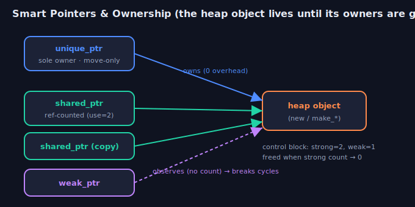

# Week 3 — C++ Review: Pointers, Smart Pointers, Memory & STL

> A focused, interview-day refresher on the four things a C++ interviewer will
> almost certainly probe: **raw pointers & references**, **smart pointers &
> ownership**, **memory management** (stack/heap, RAII, leaks & UB), and the
> **STL** you're expected to reach for without thinking. Week 12 framed these
> for robotics; this week is the concentrated review you skim the night before
> — every section ends with the reflex answer an interviewer is listening for.

---

## 1. Pointers & references — the fundamentals

A **pointer** is a variable that holds a memory address. A **reference** is an
alias for an existing object. Both let you refer to something indirectly; the
differences are what interviewers test.

| | Pointer `T*` | Reference `T&` |
|---|---|---|
| Can be null? | yes (`nullptr`) | no — must bind to an object |
| Rebindable? | yes — reseat to another object | no — bound once at init |
| Must init? | no (but uninitialized = UB to deref) | yes |
| Arithmetic? | yes (`p + 1`) | no |
| Level of indirection | explicit (`*p`, `->`) | transparent (used like the object) |

```cpp
int x = 10, y = 20;

int* p = &x;     // p holds the address of x
*p = 11;         // writes through the pointer -> x == 11
p = &y;          // reseat: p now points at y

int& r = x;      // r is another name for x
r = 99;          // writes x directly -> x == 99
// int& r2;      // ERROR: a reference must be initialized
```

**`nullptr`, not `NULL` or `0`.** `nullptr` (C++11) has type `std::nullptr_t`
and cannot be confused with the integer `0` in overload resolution — always
prefer it.

**Reading declarations (const placement).** Read right-to-left from the variable:

```cpp
const int* p;        // pointer to const int    — can't change *p, can reseat p
int* const p = &x;   // const pointer to int    — can change *p, can't reseat p
const int* const p;  // const pointer to const int — neither
```

> **Reflex:** "Reference when it's always present and never rebinds — it's
> cleaner and can't be null. Pointer (or `std::optional`) when absence or
> reseating is meaningful." A raw pointer means *non-owning* access.

---

## 2. Stack vs heap, and dynamic allocation

- **Stack:** automatic storage. Allocation is a pointer bump — essentially free
  and cache-local. Freed automatically when the variable goes out of scope. Size
  is limited (blowing it = stack overflow).
- **Heap (free store):** dynamic storage via `new`/`malloc`. Flexible size and
  lifetime, but slower, non-deterministic, and **you** are responsible for
  freeing it (or a smart pointer is).

```cpp
int a = 5;                 // on the stack — gone at end of scope
int* h = new int(5);       // on the heap — lives until you delete it
delete h;                  // release it, or it leaks

int* arr = new int[100];   // array form
delete[] arr;              // MUST match new[] with delete[] (not delete)
```

**The three cardinal `new`/`delete` rules interviewers check:**
1. Every `new` needs exactly one `delete`; every `new[]` needs one `delete[]`.
2. Mismatching them (`delete` on a `new[]`) is **undefined behavior**.
3. `delete` on a pointer twice is a **double-free** (UB); `delete nullptr` is safe.

The modern answer to all of this: **don't call `new`/`delete` yourself.** Use
smart pointers and containers so the compiler frees things for you (Section 4).

> **Reflex:** "Prefer the stack. Reach for the heap only when the size isn't
> known at compile time, the object must outlive the scope, or it's too large
> for the stack — and then wrap it in a smart pointer, not a raw `new`."

---

## 3. What goes wrong with raw memory

The whole reason smart pointers exist. Know the vocabulary cold:

- **Memory leak** — you `new` something and never `delete` it. The memory is
  unreachable but never returned. Slowly starves a long-running process.
- **Dangling pointer** — a pointer to memory that has already been freed (or to
  a stack object that went out of scope). Dereferencing it is **use-after-free**.
- **Double free** — deleting the same allocation twice — corrupts the allocator.
- **Wild/uninitialized pointer** — a pointer never set to a valid address.
- **Buffer overflow** — indexing past the end of an allocation.

```cpp
// LEAK: early return skips the delete.
void f() {
    int* p = new int[1000];
    if (error()) return;      // <-- leaked 1000 ints
    delete[] p;
}

// DANGLING: returning the address of a local.
int* bad() {
    int local = 42;
    return &local;            // local dies here -> caller gets a dangling pointer
}

// DANGLING: pointer into a vector that reallocates.
std::vector<int> v{1, 2, 3};
int* first = &v[0];
v.push_back(4);               // may reallocate the buffer...
*first = 9;                   // ...so `first` now dangles -> UB
```

All of these are **undefined behavior**: the program may crash, corrupt data, or
appear to work — the standard makes no guarantee. Catch them with
`-Wall -Wextra`, **AddressSanitizer** (`-fsanitize=address`), and **valgrind**.

> **Reflex:** "RAII plus smart pointers makes leaks, dangling, and double-frees
> structurally hard — ownership is encoded in the type and cleanup is automatic."

---

## 4. Smart pointers & ownership



A **smart pointer** is an RAII wrapper around a heap object: it owns the object
and its destructor frees it automatically. Express **who owns** the object in the
type system. All live in `<memory>`.

### `std::unique_ptr<T>` — sole ownership (the default)

- Exactly **one** owner. **Move-only** (can't be copied) — moving transfers
  ownership and nulls the source.
- **Zero runtime overhead** — same size and speed as a raw pointer; no counter.
- Create with **`std::make_unique<T>(args...)`** (C++14).

```cpp
auto p = std::make_unique<Widget>(cfg);   // p solely owns the Widget
p->run();
auto q = std::move(p);   // ownership moves to q; p is now nullptr
// auto r = q;           // ERROR: unique_ptr is not copyable
```                       // Widget destroyed automatically when q dies

### `std::shared_ptr<T>` — shared ownership

- Multiple owners share the object via an **atomic reference count** in a
  heap-allocated **control block**. The object is destroyed when the **last**
  `shared_ptr` is destroyed (count hits 0).
- Costs: an atomic increment/decrement per copy, plus the control block. Copyable.
- Create with **`std::make_shared<T>(args...)`** — one allocation for object +
  control block (faster and exception-safe vs `shared_ptr<T>(new T)`).

```cpp
auto a = std::make_shared<Map>();   // use_count() == 1
auto b = a;                         // copy -> use_count() == 2, same object
b->update();
// object freed only after BOTH a and b are gone
```

### `std::weak_ptr<T>` — non-owning observer

- Points at a `shared_ptr`-managed object **without** keeping it alive. Used to
  **break reference cycles** and to safely check "is it still there?".
- You can't dereference it directly; call **`.lock()`** to get a `shared_ptr`
  (null if the object is already gone).

```cpp
std::weak_ptr<Map> w = a;           // observes, does NOT bump the owning count
if (auto s = w.lock()) {            // promote to shared_ptr iff still alive
    s->update();
}                                   // else the object was already destroyed
```

### The reference-cycle trap

Two objects that hold `shared_ptr`s to each other never reach count 0 — they
**leak**. Break the cycle by making one direction a `weak_ptr`.

```cpp
struct Node {
    std::shared_ptr<Node> next;     // owns forward
    std::weak_ptr<Node>   prev;     // observes back — WITHOUT weak_ptr this leaks
};
```

### Quick comparison

| | `unique_ptr` | `shared_ptr` | `weak_ptr` |
|---|---|---|---|
| Ownership | sole | shared | none (observer) |
| Copyable | no (move-only) | yes | yes |
| Overhead | zero | atomic refcount + control block | control block ptr |
| Use when | default single owner | genuinely shared lifetime | break cycles / check existence |

> **Reflex:** "Default to `unique_ptr`. Escalate to `shared_ptr` only when
> ownership is *genuinely* shared — the atomics and hidden lifetimes aren't free.
> Use `weak_ptr` to break cycles. A raw pointer/reference is fine for non-owning
> access." Bonus points: `enable_shared_from_this` when an object needs to hand
> out a `shared_ptr` to itself; custom deleters as a second template arg.

---

## 5. RAII, the Rule of 0/3/5 & move semantics

### RAII — the idea everything above rests on

**Resource Acquisition Is Initialization:** tie a resource (memory, lock, file,
socket) to an object's lifetime. The **constructor acquires**; the **destructor
releases** — automatically, even when an exception unwinds the stack. It's *why*
you almost never write `delete`, `unlock()`, or `close()` by hand.

```cpp
{
    std::lock_guard<std::mutex> lk(m);   // acquires
    // ... critical section — even a throw here ...
}                                        // destructor releases, always
```

### Rule of 0 / 3 / 5

- **Rule of 3:** if you write any of { destructor, copy constructor, copy
  assignment }, you almost certainly need all three (they manage the same
  resource).
- **Rule of 5:** with move semantics, add the **move constructor** and **move
  assignment**.
- **Rule of 0 (the goal):** design so you need *none* — let RAII members
  (`vector`, `string`, `unique_ptr`) manage resources and the compiler-generated
  special members just work.

```cpp
struct Buffer {
    std::vector<float> data;   // Rule of 0: vector already copies AND moves correctly
};                             // no destructor / copy / move needed
```

### Move semantics

Copying a big vector or matrix duplicates its heap buffer — expensive. **Moving**
transfers the guts (pointer + size) and leaves the source empty — cheap.

- An **lvalue** has a name/address; an **rvalue** is a temporary. `T&&` binds
  rvalues.
- **`std::move(x)` moves nothing** — it's just a `static_cast` to `T&&` that
  marks `x` as *eligible* to be moved from. The move constructor/assignment does
  the actual work; afterward `x` is valid-but-unspecified (only assign or destroy).

```cpp
std::vector<int> a = makeBig();       // move / copy-elision — no deep copy
std::vector<int> b = std::move(a);    // steals a's buffer; a is now empty
queue.push_back(std::move(b));        // hand ownership to the queue, no copy
```

> **Reflex:** "How do you guarantee cleanup on every path, including exceptions?
> **RAII.** `std::move` is a cast, not a move. Aim for Rule of 0; if you manage a
> raw resource, obey Rule of 5."

---

## 6. STL containers & complexity

The container decision table interviewers expect you to recite:

| Container | Backing | Access / find | Insert | Notes |
|---|---|---|---|---|
| `vector` | contiguous array | `O(1)` index, `O(n)` find | amortized `O(1)` push_back | **the default**; cache-friendly; `reserve()` to avoid reallocs |
| `array` | fixed C array | `O(1)` | — | compile-time size, no heap |
| `deque` | chunked | `O(1)` index | `O(1)` both ends | fast push front & back |
| `list` | doubly linked | `O(n)` find | `O(1)` splice | stable iterators; rarely worth it |
| `map` / `set` | red-black tree | `O(log n)` | `O(log n)` | **ordered** keys; sorted iteration |
| `unordered_map` / `set` | hash table | `O(1)` avg, `O(n)` worst | `O(1)` avg | no ordering; needs a good hash |
| `stack` / `queue` / `priority_queue` | adaptors | — | — | wrap `deque`/`vector`; heap for PQ |

- **`vector` is the default.** Contiguous memory wins on modern CPUs — even
  linear scans beat pointer-chasing a `list`. Use `reserve(n)` when you know the
  size to avoid repeated reallocations.
- **`unordered_map` for lookups**, `map` only when you need ordering, range
  queries, or sorted iteration.
- **`emplace_back` vs `push_back`:** `emplace` constructs in place from the args
  (can avoid a temporary); `push_back` takes an already-built object.

```cpp
std::vector<int> v;
v.reserve(1000);                        // one allocation up front
for (int i = 0; i < 1000; ++i) v.push_back(i);

std::unordered_map<int, Track> tracks;  // O(1) average lookup by id
if (auto it = tracks.find(id); it != tracks.end())   // find, don't operator[]
    it->second.update();
```

> **Note:** `map::operator[]` **inserts** a default-constructed value if the key
> is missing — a classic bug when you meant to only *read*. Use `.find()` or
> `.at()` (which throws) for read-only access.

---

## 7. Iterators & iterator invalidation

An **iterator** generalizes a pointer: `begin()`/`end()` delimit a half-open
range `[begin, end)`. The interview trap is **invalidation** — an operation that
makes existing iterators/pointers/references dangle.

- **`vector`:** any reallocation (from `push_back`/`insert` past capacity)
  invalidates **all** iterators & pointers. `erase` invalidates from the erase
  point onward.
- **`deque`:** insert/erase in the middle invalidates all; at the ends may
  invalidate iterators but not references.
- **`map`/`set` (node-based):** insert never invalidates; erase invalidates only
  the erased element. **`list`** likewise — stable iterators are its main perk.

```cpp
// Erase-while-iterating done right: erase() returns the next valid iterator.
for (auto it = v.begin(); it != v.end(); ) {
    if (*it % 2 == 0) it = v.erase(it);   // don't ++ a just-erased iterator
    else              ++it;
}
```

> **Reflex:** "Growing a `vector` can reallocate and invalidate every iterator
> and pointer into it — so never cache `&v[i]` across a `push_back`. Node-based
> containers keep iterators stable except to the erased node."

---

## 8. STL algorithms & idioms worth knowing

Prefer `<algorithm>` over hand-rolled loops — clearer intent, well-tested,
often faster. High-frequency ones:

```cpp
std::sort(v.begin(), v.end());                          // O(n log n)
std::sort(v.begin(), v.end(), [](auto a, auto b){ return a > b; });  // custom cmp

auto it = std::find(v.begin(), v.end(), target);        // linear search
bool ok = std::binary_search(v.begin(), v.end(), x);    // needs sorted range

int sum   = std::accumulate(v.begin(), v.end(), 0);     // fold
int evens = std::count_if(v.begin(), v.end(), [](int x){ return x % 2 == 0; });

v.erase(std::remove(v.begin(), v.end(), 0), v.end());   // erase-remove idiom
std::transform(a.begin(), a.end(), out.begin(), [](int x){ return x * x; });

auto [lo, hi] = std::equal_range(v.begin(), v.end(), key);   // sorted-range span
auto mx = std::max_element(v.begin(), v.end());
```

- **erase-remove idiom:** `remove` only shuffles kept elements forward and
  returns the new logical end; `erase` actually shrinks the container. (C++20:
  `std::erase`/`std::erase_if` do both.)
- **`std::sort` is introsort** (quicksort → heapsort fallback), `O(n log n)`
  worst case; **`std::stable_sort`** preserves equal-element order.
- Range-based `for` + **structured bindings** are the idiomatic traversal:

```cpp
for (const auto& [key, val] : some_map) use(key, val);   // no copies
```

> **Reflex:** "Reach for `<algorithm>` first. Know the erase-remove idiom,
> that `binary_search`/`lower_bound` need a sorted range, and that passing
> containers by `const&` avoids copies."

---

## 9. Common pitfalls checklist

- Returning a reference/pointer to a **local** → dangling.
- Caching `&v[i]` or an iterator across a `vector` **reallocation** → dangling.
- `map[key]` **silently inserts** when you meant to read → use `.find()`/`.at()`.
- Mismatched `new[]` / `delete` (or forgetting `delete`) → UB / leak.
- Copying a `shared_ptr` in a hot loop → needless atomic traffic.
- **`shared_ptr` cycles** → leak; break with `weak_ptr`.
- Storing a raw `this` pointer that outlives the object → use-after-free.
- Signed integer overflow, out-of-bounds, uninitialized reads → all UB.

---

## Interview-style questions
*Click a question to reveal a model answer.*

??? What's the difference between a pointer and a reference?
A **pointer** is a variable holding an address: it can be null, reseated to point elsewhere, and supports arithmetic; you dereference it explicitly (`*p`, `p->`). A **reference** is an alias for an existing object: it must be initialized, can't be null, can't be rebound, and is used transparently like the object itself. Use a **reference** when the thing is always present and you won't rebind (cleaner, safer — the default for parameters); use a **pointer** (or `std::optional`/smart pointer) when absence is meaningful, you need to reseat, or you need non-owning nullable access.

??? What is `nullptr` and why prefer it over `NULL` or `0`?
`nullptr` (C++11) is a null pointer literal of type `std::nullptr_t`. Unlike `NULL` (often a macro for `0`) or the literal `0`, it's unambiguously a pointer, so it resolves correctly in overload sets — `f(int)` vs `f(char*)` picks the pointer overload with `nullptr` but the `int` overload with `0`/`NULL`. Always use `nullptr`.

??? Stack vs heap — how do you decide where to put an object?
**Stack** allocation is automatic, essentially free (a pointer bump), cache-local, and freed at end of scope — but limited in size and lifetime. **Heap** (`new`/`malloc`) gives flexible size and lifetime but is slower, non-deterministic, and must be freed manually (or by a smart pointer). Prefer the stack; go to the heap only when the size is unknown at compile time, the object must outlive its scope, or it's too large for the stack — and then wrap it in a `unique_ptr`/`shared_ptr` rather than raw `new`.

??? Explain memory leak, dangling pointer, and double free.
A **memory leak** is heap memory you allocated but never freed — it stays reserved but unreachable, slowly exhausting a long-running process. A **dangling pointer** points at memory that's already been freed or a local that went out of scope; dereferencing it is **use-after-free** (UB). A **double free** deletes the same allocation twice, corrupting the allocator. All three are undefined behavior. RAII + smart pointers make them structurally hard; sanitizers (ASan) and valgrind catch the rest.

??? `unique_ptr` vs `shared_ptr` vs `weak_ptr` — when and what do they cost?
**`unique_ptr`**: sole ownership, move-only, **zero overhead** (same as a raw pointer) — the default. **`shared_ptr`**: shared ownership via an **atomic reference count** in a control block; the object dies when the last owner does. Costs atomic inc/dec per copy plus the control block — use only when ownership is genuinely shared. **`weak_ptr`**: a non-owning observer of a `shared_ptr` that doesn't keep the object alive; used to **break reference cycles** and to check existence via `.lock()`. Default to `unique_ptr`, escalate deliberately.

??? Why use `make_unique` / `make_shared` instead of `new`?
They avoid a raw `new` in your code (so there's no window where an exception leaks it) and read more clearly. **`make_shared`** additionally does a **single allocation** for the object *and* the control block, versus `shared_ptr<T>(new T)` which allocates twice and has an exception-safety gap. The one caveat: `make_shared` keeps the object's memory alive as long as any `weak_ptr` exists (object + control block share one allocation), so for very large objects with long-lived `weak_ptr`s you might prefer the two-allocation form.

??? What is a `shared_ptr` reference cycle and how do you fix it?
If object A holds a `shared_ptr` to B and B holds a `shared_ptr` back to A, each keeps the other's reference count above zero, so neither is ever destroyed — a **leak**. Break the cycle by making one direction a **`weak_ptr`** (the non-owning "back" or "parent" link), so only one direction owns. This is the classic parent/child or doubly-linked-node situation.

??? What does `std::move` actually do?
**Nothing at runtime.** `std::move(x)` is a `static_cast` to an rvalue reference (`T&&`) that marks `x` as *eligible to be moved from*. It's the **move constructor / move assignment** — selected by overload resolution because the argument is now an rvalue — that actually transfers the internals (e.g. steals a vector's buffer) and leaves the source in a valid-but-unspecified state. After moving from `x`, only assign to it or destroy it.

??? Explain RAII and the Rule of 0/3/5.
**RAII** ties a resource to an object's lifetime: the constructor acquires it, the destructor releases it — automatically, including during exception unwinding. It's why you rarely write `delete`/`unlock`/`close` by hand. **Rule of 3:** if you define any of destructor / copy ctor / copy assignment you probably need all three. **Rule of 5:** with move semantics, add move ctor and move assignment. **Rule of 0 (the goal):** design classes that need none of them by using RAII members (`vector`, `unique_ptr`) so the compiler-generated defaults are correct.

??? `map` vs `unordered_map` — how do they differ and when do you pick each?
`std::map` is a balanced **red-black tree**: keys are **ordered**, operations are **`O(log n)`**, iteration is sorted, iterators stay stable across inserts. `std::unordered_map` is a **hash table**: **`O(1)` average** lookup/insert (`O(n)` worst case with poor hashing), **no ordering**, needs a good hash for the key type. Pick `unordered_map` for pure fast lookups (the common case); pick `map` when you need ordering, range queries, or sorted iteration.

??? What is iterator invalidation? Give an example.
It's when a container operation makes existing iterators/pointers/references dangle. The classic case: appending to a `std::vector` past its capacity **reallocates** the buffer, invalidating **all** iterators and pointers into it — so caching `&v[0]` and then `push_back`-ing is UB. `erase` invalidates from the erase point onward. Node-based containers (`map`, `set`, `list`) are stable: insert never invalidates, and erase only invalidates the erased element. When erasing in a loop, use the iterator that `erase()` **returns**.

??? What is the erase-remove idiom?
`std::remove`/`std::remove_if` don't actually remove anything from a container — they shuffle the *kept* elements to the front and return an iterator to the new logical end, leaving junk after it. To truly shrink the container you call `container.erase(remove(...), end())` — hence "erase-remove." (C++20 adds `std::erase`/`std::erase_if` that do both in one call.)

??? How should you pass parameters: by value, `const&`, or `&&`?
**`const T&`** for large read-only inputs — no copy, no mutation (the default for non-trivial types). **By value** for small/cheap-to-copy types, or "sink" parameters the function will take ownership of (then `std::move` it into place). **`T&&`** (rvalue ref) when the function will take ownership and you want to enable a move. **`T&`** (non-const) only for genuine in/out parameters. Passing a big container by value silently deep-copies it — a common performance bug.

??? Why is `vector` usually faster than `list` even for insertions?
Because of **cache locality**. A `vector`'s elements are contiguous, so scans and even shifting elements stream through cache and prefetch well, while a `list` chases pointers to scattered heap nodes, missing cache on nearly every step — and each node is a separate allocation. Unless you need `O(1)` splicing or guaranteed stable iterators, a `vector` (or `deque`) beats a `list` in practice even where big-O suggests otherwise.

## Resources
- *Effective Modern C++* (Scott Meyers) — items on smart pointers & move are gold.
- cppreference.com — the reference you'll actually use day to day.
- C++ Core Guidelines (isocpp.github.io/CppCoreGuidelines) — R.* (resource) & F.* rules.
- Compiler Explorer (godbolt.org) — *see* that `unique_ptr` compiles to a raw pointer.

➡ **Related:** the robotics-flavored companion is [Week 12: C++ for Robotics](lecture.html?week=12) (RAII in real-time loops, concurrency, ring buffers, Eigen).
