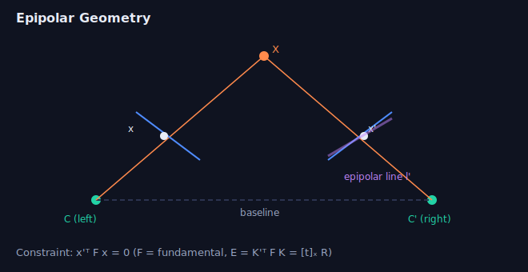

# Week 5 — Features & Multi-View Geometry

> This is the heart of classical perception: find repeatable points, match them
> across images, and use the matches to recover camera motion and 3D structure.

---

## 1. Feature detection

A good keypoint is **repeatable** (found again under viewpoint/lighting change) and
**localizable** (well-defined position).

- **Harris corner:** looks at the second-moment matrix `M = Σ ∇I ∇Iᵀ` over a
  window. Two large eigenvalues → corner; one → edge; none → flat. Response
  `R = det(M) − k·tr(M)²`.
- **FAST:** checks a ring of 16 pixels around a candidate — fast enough for
  real-time SLAM front-ends.
- **Blob detectors (DoG / LoG):** find scale + location → SIFT keypoints.

## 2. Feature description & matching

- **SIFT:** 128-D histogram-of-gradients descriptor; scale & rotation invariant.
  Gold standard for accuracy (now patent-free).
- **ORB:** FAST + rotated BRIEF, binary descriptor; matched with **Hamming
  distance**. Fast, the default in ORB-SLAM.
- **Matching:** nearest neighbor in descriptor space; apply **Lowe's ratio test**
  (`d1 / d2 < 0.7..0.8`) to reject ambiguous matches; cross-check; then geometric
  verification with RANSAC.

## 3. RANSAC — robust fitting

Matches contain outliers; least squares alone gets wrecked by them.

```
repeat N times:
    sample the minimal set (e.g. 4 pts for homography, 8 for F)
    fit the model
    count inliers (residual < threshold)
keep the model with the most inliers; refit on all inliers
```
- Choose `N` from desired success prob `p` and inlier ratio `w`:
  `N = log(1−p) / log(1 − wˢ)`.
- Variants: MSAC, PROSAC, LO-RANSAC.

> RANSAC shows up far beyond CV — plane fitting in point clouds, line fitting,
> any model-with-outliers situation. Know the loop and the `N` formula.

## 4. Epipolar geometry (two views)



A 3D point seen in two cameras gives corresponding pixels `x ↔ x'`. They satisfy:

```
x'ᵀ F x = 0          (fundamental matrix, uncalibrated, pixels)
x'ᵀ E x = 0          (essential matrix, calibrated/normalized rays)
E = K'ᵀ F K           E = [t]ₓ R
```
- A point in image 1 constrains its match in image 2 to lie on a line (the
  **epipolar line**) → reduces matching from 2D to 1D search.
- **8-point algorithm** estimates `F` linearly (SVD), with Hartley normalization;
  enforce rank-2 by zeroing the smallest singular value.
- **5-point algorithm** estimates `E` from calibrated cameras (minimal → great with
  RANSAC).
- Decompose `E = [t]ₓR` → 4 solutions for `(R, t)`; pick the one with points in
  front of both cameras (cheirality). Translation is recovered **up to scale**.

## 5. Homography (planar / pure rotation)

`x' = H x` (3×3) relates two views of a **plane** or images under **pure camera
rotation**. Uses: image stitching/panoramas, AR marker pose, ground-plane warps
(bird's-eye view). Estimated from ≥4 correspondences (DLT + SVD).

> Decision: planar scene or pure rotation → homography; general 3D scene with
> translation → fundamental/essential matrix.

## 6. Triangulation & PnP

- **Triangulation:** given `x ↔ x'` and known camera matrices, recover the 3D point
  (linear DLT via SVD, then nonlinear refine of reprojection error).
- **PnP (Perspective-n-Point):** given known 3D points and their 2D projections,
  find the camera pose `(R, t)`. P3P (minimal, 3 pts) + RANSAC + nonlinear refine.
  This is how you **relocalize** against a known map.

## 7. Bundle adjustment

The grand nonlinear least squares that jointly refines **all camera poses and 3D
points** by minimizing total reprojection error:

```
min Σ_i Σ_j ρ( ‖ x_ij − π(K, T_i, X_j) ‖² )
```
- Solved with LM; exploits **sparsity** (Schur complement) because each point sees
  few cameras. `ρ` is a robust (Huber) kernel to tame outliers.
- The back-end of essentially every SfM / visual SLAM system.

---

## Interview-style questions
*Click a question to reveal a model answer.*

??? Harris vs. SIFT vs. ORB — when would you pick each?
**Harris**: cheap corner detector, not scale/rotation-invariant and no descriptor — good for tracking at roughly known scale. **SIFT**: scale + rotation invariant, 128-D float descriptor, highest accuracy/robustness but slower — good for SfM and wide-baseline matching where accuracy dominates. **ORB**: FAST + oriented BRIEF, binary descriptor matched by Hamming distance, very fast — good for real-time SLAM / embedded. Choose along the speed-vs-robustness trade-off.

??? What does `x'ᵀ F x = 0` mean geometrically? Why rank-2?
It's the **epipolar constraint**: a match `x'` must lie on the epipolar line `l' = Fx` in the second image (and `x` on `Fᵀx'`). `F` is **rank-2** (`det F = 0`) because all epipolar lines pass through a single point — the epipole — which is `F`'s null vector; a full-rank 3×3 wouldn't produce that pencil of lines. After the linear 8-point solve you enforce rank-2 by zeroing the smallest singular value.

??? Essential vs. fundamental matrix — what's the difference?
Both encode the **same epipolar geometry** (a point in one view maps to an epipolar line in the other), but they operate in different coordinates. The **fundamental matrix** `F` works on raw **pixel** coordinates and needs no calibration — `x'ᵀ F x = 0` — so it bakes both cameras' intrinsics into the geometry (7 DoF, rank 2). The **essential matrix** `E` works on **normalized/calibrated rays** (`x̂ = K⁻¹x`) and assumes you know the intrinsics — `x̂'ᵀ E x̂ = 0` — so it encodes **pure relative pose** (5 DoF: 3 rotation + 3 translation − 1 scale, rank 2). They're linked by `E = K'ᵀ F K`. The payoff: `E` decomposes directly into `[t]ₓR` (relative rotation + translation up to scale), which is exactly what you want for visual odometry; `F` can't give clean `(R, t)` until you supply `K`. Estimation: `F` from ≥8 points (uncalibrated, 8-point), `E` from ≥5 points (calibrated, Nistér 5-point — the SLAM/VO workhorse, and it survives planar scenes where the 8-point degenerates). One-liner: *the essential matrix is the fundamental matrix for calibrated cameras.* On a drone with offline-calibrated cameras you'd always use `E`; `F` is for uncalibrated or heterogeneous imagery.

??? Why is monocular translation only recoverable up to scale? How do you fix the scale?
From images alone you can't distinguish a small scene viewed up close from a large scene far away, so scaling the whole scene and the translation by the same factor reprojects identically — `E = [t]ₓR` only fixes the **direction** of `t` (unit norm). Recover metric scale with extra information: **stereo baseline, RGB-D/LiDAR depth, IMU + gravity (VIO), known object size, or wheel odometry**. Loop closure + global BA also bound scale drift.

??? Homography vs. fundamental matrix — what scene geometry distinguishes them?
A **homography** (`x' = Hx`, invertible 3×3) applies when the scene is **planar** or the camera undergoes **pure rotation** (no parallax). The **fundamental/essential** matrix applies to a **general 3D scene with camera translation** (parallax). In practice you fit both with RANSAC and pick via a model-selection score (e.g. GRIC); planar/degenerate scenes make `F` ill-conditioned, which is exactly why ORB-SLAM runs both in parallel.

??? Derive how many RANSAC iterations you need for 50% inliers, 4-point model, 99% success.
Use `N = log(1−p) / log(1 − wˢ)` with `p = 0.99`, `w = 0.5`, `s = 4`. Then `wˢ = 0.0625`, `1 − wˢ = 0.9375`, `log(0.9375) ≈ −0.0645`, `log(0.01) ≈ −4.605`, so `N ≈ 71.4` → **about 72 iterations** (round up).

??? What makes bundle adjustment tractable for thousands of points?
**Sparsity.** Each 3D point is seen by only a few cameras, so the Hessian `JᵀJ` is block-sparse with an arrowhead structure. The **Schur complement** marginalizes the many point variables to solve a much smaller reduced camera system, then back-substitutes for the points. Combined with robust kernels (Huber), good initialization, and sparse Cholesky solvers, thousands of points become feasible in real time.

## Resources
- Hartley & Zisserman, *Multiple View Geometry* — the bible (Ch. 9–11, 18).
- Szeliski Ch. 7–8, 11.
- Cyrill Stachniss "Photogrammetry" YouTube lectures (excellent, intuitive).

➡ **Practice (solve in-site):** [w4_ransac.py](practice.html?p=rob-ransac-line-inliers), [w4_homography_fmatrix.py](practice.html?p=rob-rigid-align-2d)
