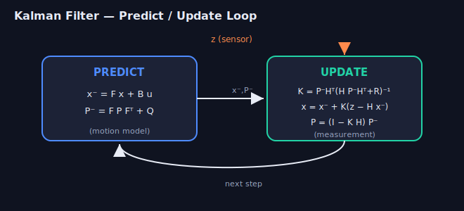

# Week 6 — State Estimation & Filtering

> Sensors are noisy and arrive over time. Filtering fuses a motion model with
> measurements to maintain a best estimate **and its uncertainty**.

---

## 1. The recursive Bayes filter

Everything below is a special case of:

```
predict:  bel⁻(xₜ) = ∫ p(xₜ | xₜ₋₁, uₜ) bel(xₜ₋₁) dxₜ₋₁
update:   bel(xₜ)  ∝ p(zₜ | xₜ) · bel⁻(xₜ)
```
- **Predict** pushes belief through the **motion model** (uncertainty grows).
- **Update** multiplies in the **measurement likelihood** (uncertainty shrinks).
- Different assumptions on these distributions → KF, EKF, UKF, particle filter.

---

## 2. Kalman Filter (linear, Gaussian)



Assumes linear motion/measurement and Gaussian noise. State `x ~ N(x̂, P)`.

```
Predict:   x̂⁻ = F x̂ + B u
           P⁻  = F P Fᵀ + Q
Update:    K   = P⁻ Hᵀ (H P⁻ Hᵀ + R)⁻¹      (Kalman gain)
           x̂   = x̂⁻ + K (z − H x̂⁻)            (innovation = z − H x̂⁻)
           P   = (I − K H) P⁻
```
- `F` motion, `H` measurement, `Q` process noise, `R` measurement noise.
- **Kalman gain** `K` interpolates between prediction and measurement based on
  relative confidence: noisy sensor (`R` large) → trust prediction, and vice versa.
- It is the **optimal** estimator under the linear-Gaussian assumptions.

> The whole filter is "weighted average of prediction and measurement, weighted by
> their covariances." If you can say that, you understand it.

---

## 3. Extended Kalman Filter (EKF)

Real motion/measurement models are nonlinear. EKF **linearizes** them with
Jacobians at the current estimate:

```
x̂⁻ = f(x̂, u)                 F = ∂f/∂x |x̂
z_pred = h(x̂⁻)               H = ∂h/∂x |x̂⁻
(then same gain/update equations as KF, using F and H)
```
- Pros: cheap, ubiquitous (robot localization, VIO, GPS/IMU fusion).
- Cons: linearization error → can diverge if highly nonlinear or poorly
  initialized; Jacobians are error-prone to derive.

## 4. Unscented Kalman Filter (UKF)

Instead of linearizing, propagate a deterministic set of **sigma points** through
the nonlinear function and recompute mean/covariance.
- More accurate than EKF for strong nonlinearity, no Jacobians needed.
- Slightly more compute; same Gaussian assumption.

## 5. Particle Filter (Monte Carlo)

Represent the belief by **weighted samples** — handles non-Gaussian, multimodal
beliefs (e.g. the "kidnapped robot" / global localization).

```
for each particle: propagate via motion model (+noise)
weight by measurement likelihood p(z|x)
resample proportional to weight  (deal with particle depletion)
```
- Used in **Monte Carlo Localization (AMCL)** on known maps.
- Cost grows with state dimension (curse of dimensionality) → great in 2D/3D pose,
  not for high-D states.

---

## 6. Making filters actually work

- **Tuning `Q` and `R`:** too-small `R` → overconfident, ignores good sensor; too
  small `Q` → filter "locks up" and lags reality. Start from sensor datasheets.
- **Innovation gating:** reject measurements whose Mahalanobis distance is too
  large (outlier/false association).
- **Consistency:** check **NEES/NIS** — is the actual error consistent with the
  reported covariance? An "optimistic" filter (P too small) is dangerous.
- **Observability:** is the state even recoverable from the measurements? (e.g.
  monocular VIO scale needs motion/excitation).

---

## Interview-style questions
*Click a question to reveal a model answer.*

??? Derive the Kalman gain — what is it trading off?
After predicting `x⁻, P⁻`, choose the gain `K` that minimizes the posterior covariance (trace of `P`). The result is **`K = P⁻Hᵀ (H P⁻ Hᵀ + R)⁻¹`**, i.e. "prediction uncertainty mapped into measurement space" divided by "total innovation uncertainty (prediction + measurement)". It trades trust between model and sensor: large `R` (noisy sensor) → small `K` (trust the prediction); large `P⁻` or small `R` → large `K` (trust the measurement). The update is `x = x⁻ + K·(innovation)`.

??? EKF vs. UKF vs. particle filter: when does each break down?
**EKF** breaks under strong nonlinearity or poor initialization — first-order linearization is biased and the hand-derived Jacobians are error-prone. **UKF** handles nonlinearity better (sigma points, no Jacobians) but still assumes a single Gaussian and costs a bit more; it struggles with multimodal beliefs. **Particle filter** represents arbitrary/multimodal distributions but suffers the **curse of dimensionality** (particle count grows exponentially with state size) and sample impoverishment.

??? What is the innovation, and how do you use it to reject outliers?
The **innovation** (residual) is `z − H·x⁻`, the gap between the actual and predicted measurement; its covariance is `S = H P⁻ Hᵀ + R`. Compute the **normalized innovation squared** `d² = innovᵀ S⁻¹ innov` and **gate**: reject the measurement if `d²` exceeds a chi-square threshold for the measurement's DoF. This stops outliers / bad data associations from corrupting the state.

??? Your EKF diverges. List the things you'd check.
Wrong or badly-derived **Jacobians** (most common); poor **initialization** (state far off, or `P` too small/large); mis-tuned **`Q`/`R`** (overconfident); excessive **nonlinearity** → switch to UKF/iterated EKF; **numerical** issues → use Joseph-form covariance update or a square-root filter and keep `P` symmetric PSD; **angle-wrapping** bugs in residuals; **observability** — maybe the state isn't observable from those measurements; and **time-sync / wrong `dt`**.

??? Why can't a particle filter scale to a 12-D state?
Particles must cover the state space, and the number needed grows **roughly exponentially with dimension**, so a 12-D state would need an astronomical particle count to avoid weight collapse (one particle dominating). PFs shine in low dimensions (2–3D pose, MCL). For high-D states use Gaussian filters / optimization, or **Rao-Blackwellization** to factor out the linear-Gaussian substates (as FastSLAM does).

??? What does it mean for a filter to be "inconsistent / overconfident"?
A filter is **inconsistent** when its reported covariance `P` doesn't match the actual estimation error. **Overconfident** means the true errors are systematically larger than `P` claims (`P` too small), so gating rejects good measurements and the filter can diverge; underconfident is the opposite. You measure this with **NEES** (state error) and **NIS** (innovation) against chi-square bounds over many runs. Common causes: ignored correlations, linearization error, double-counting information.

## Resources
- Thrun, Burgard, Fox, *Probabilistic Robotics* — Ch. 2–4, 7–8 (the canonical text).
- Roger Labbe, *Kalman and Bayesian Filters in Python* — free, interactive notebooks.
- Cyrill Stachniss filtering lectures (YouTube).

➡ **Practice (solve in-site):** [w5_kalman_1d.py](practice.html?p=rob-kalman-1d), [w5_measurement_fusion](practice.html?p=rob-measurement-fusion) — plus the full [w5_ekf_localization.py](coding-practice/robotics/w5_ekf_localization.py) numpy reference
