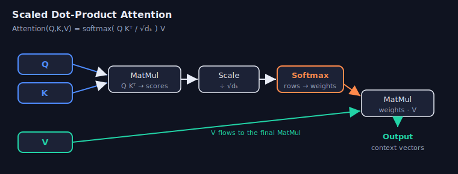
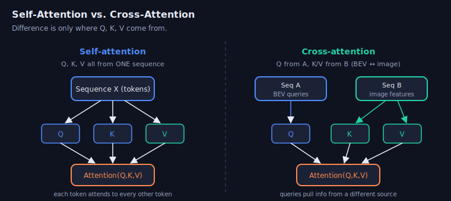
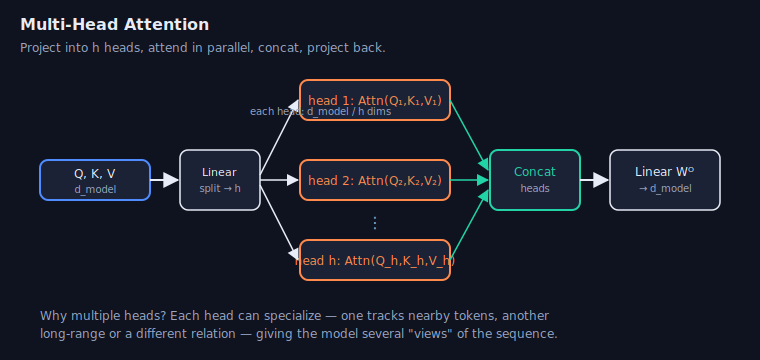
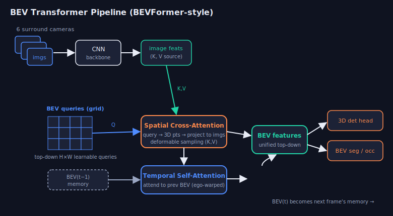

# Week 15 — BEV Transformers & Attention

> Modern multi-camera 3D perception runs on transformers. To understand
> BEVFormer/DETR3D you first need the transformer itself: **tokens, attention,
> and multi-head**. This note builds attention from scratch, then shows exactly
> how BEV models reuse it. Know self vs. cross vs. multi-head cold — it's the most
> common whiteboard ask for a perception role.

---

## 1. Why transformers for perception?

CNNs aggregate information **locally** — each output sees only its receptive
field, and long-range context requires stacking many layers. Attention instead
lets **every element talk to every other element in one step**, with the
interaction *learned* and *content-dependent* rather than fixed by a kernel.

For BEV that is exactly what we need: a top-down grid cell must gather evidence
from **whichever pixels, in whichever cameras, happen to see that location** —
an inherently global, geometry-driven lookup. Attention expresses it naturally:
the BEV cell is a *query*, the image features are *keys/values*.

- **CNN:** fixed local weights, translation-equivariant, cheap.
- **Attention:** global, content-adaptive routing, permutation-equivariant, but
  costs `O(N²)` in the number of tokens (the whole game in BEV is making it sparse).

---

## 2. The transformer in one picture

A transformer turns a set of **tokens** (vectors) into a new set of tokens, where
each output is a context-aware mix of the inputs. The repeating unit is a **block**:

```
        ┌─────────────────────────── Transformer block ───────────────────────────┐
 x  ──▶  │  ┌────────────────┐   +    ┌──────────┐   ┌──────────────┐   +   ┌──────┐ │ ──▶ x'
         │  │ Multi-Head Attn│──▶(add)─│ LayerNorm│──▶│ Feed-Forward │─▶(add)│ Norm │ │
         │  └────────────────┘  skip   └──────────┘   │  MLP (FFN)   │ skip  └──────┘ │
         │         ▲                                  └──────────────┘               │
         └─────────┼──────────────────────────────────────────────────────────────-─┘
            positional encoding added to token embeddings
```

The two sublayers are **(1) attention** (mix across tokens) and **(2) a
position-wise MLP** (transform each token independently). Each is wrapped in a
**residual connection + LayerNorm** so deep stacks train stably. Everything
interesting happens in the attention sublayer — so start there.

---

## 3. Scaled dot-product attention

Attention answers: *"for each query, how much should I read from each value?"*
Each token is projected into three roles:

- **Query (Q)** — what this token is looking for.
- **Key (K)** — what each token offers (used for matching).
- **Value (V)** — the actual content returned.



The score between a query and a key is their **dot product** (high when aligned).
Scale by `√dₖ` to keep the softmax from saturating, normalize each row to weights,
and take the weighted sum of values:

```
Attention(Q, K, V) = softmax( Q Kᵀ / √dₖ ) V

   Q: (n_q, dₖ)   K: (n_k, dₖ)   V: (n_k, dᵥ)
   QKᵀ:           (n_q, n_k)   → one score per (query, key) pair
   softmax rows → (n_q, n_k)   → weights that sum to 1 per query
   · V          → (n_q, dᵥ)    → one context vector per query
```

> **Why divide by √dₖ?** Classic interview question — here's the full chain of reasoning.
>
> **1. A score is a sum of `dₖ` terms.** Each score is `q·k = Σᵢ qᵢkᵢ`, a sum over the
> `dₖ` dimensions. Assume the components are independent with mean 0 and variance 1
> (roughly true right after init/normalization).
>
> **2. The spread grows as `√dₖ`.** Each product `qᵢkᵢ` has mean 0 and variance 1, and
> variances of independent terms *add*, so the score has variance `dₖ` and standard
> deviation `√dₖ`. It's not the values that grow — it's the *spread* of the dot product.
> With `dₖ = 64`, scores swing by ~±8 instead of ~±1.
>
> **3. Large scores saturate softmax.** When inputs are spread far apart, the exponential
> blows up the largest one and the output collapses toward a **one-hot vector**
> (one weight ≈ 1, the rest ≈ 0).
>
> **4. Saturation kills gradients.** The softmax Jacobian is `∂pᵢ/∂xⱼ = pᵢ(δᵢⱼ − pⱼ)`.
> When `p` is nearly one-hot, every `pᵢ(1−pᵢ) ≈ 0`, so gradients vanish — the same
> vanishing-gradient problem as a saturated sigmoid. The network can barely learn to
> re-weight attention.
>
> **5. The fix.** Dividing a random variable by `√dₖ` divides its standard deviation by
> `√dₖ`, taking the score variance from `dₖ` back to **1**, *independent of dimension*.
> Softmax stays in its responsive region, gradients stay healthy, and training behaves
> the same no matter how large you make `dₖ` — exactly what you want when scaling up.
>
> *One-line intuition:* the dot product is a sum, and sums of more terms naturally get
> bigger in spread; `√dₖ` is precisely that growth rate, so dividing by it cancels the
> effect and keeps softmax's inputs at a stable scale.

A minimal NumPy implementation:

```python
import numpy as np

def softmax(x, axis=-1):
    x = x - x.max(axis=axis, keepdims=True)      # numerical stability
    e = np.exp(x)
    return e / e.sum(axis=axis, keepdims=True)

def scaled_dot_product_attention(Q, K, V, mask=None):
    # Q:(n_q,d)  K:(n_k,d)  V:(n_k,dv)
    d_k = Q.shape[-1]
    scores = Q @ K.T / np.sqrt(d_k)              # (n_q, n_k)
    if mask is not None:
        scores = np.where(mask, scores, -1e9)    # block disallowed positions
    weights = softmax(scores, axis=-1)           # (n_q, n_k)
    return weights @ V, weights                  # context:(n_q,dv), attn map
```

The returned `weights` matrix **is** the attention map you visualize — row `i`
shows what query `i` looked at.

---

## 4. Self-attention vs. cross-attention

The *only* difference between the two is **where Q, K, V come from**.



- **Self-attention:** `Q, K, V` are all linear projections of the **same**
  sequence. Every token attends to every other token in that sequence — this is
  how a token gathers context from its peers (ViT patches attending to each other;
  BEV cells attending to neighboring BEV cells over time).
- **Cross-attention:** `Q` comes from **sequence A**, while `K, V` come from a
  **different sequence B**. The queries *pull* information from another source.
  This is the bridge between modalities/views — in **BEVFormer the BEV queries
  (A) cross-attend into the image features (B)**; in a translation decoder the
  output tokens cross-attend into the encoded input sentence.

| | Self-attention | Cross-attention |
|---|---|---|
| Q from | sequence X | sequence A (e.g. BEV grid) |
| K, V from | sequence X | sequence B (e.g. image feats) |
| Purpose | mix within a set | transfer between two sets |
| BEV role | temporal (BEV ↔ past BEV) | spatial (BEV ↔ images) |

> Reflex answer: *"Self- and cross-attention use identical math — scaled
> dot-product. The difference is whether keys/values come from the same sequence
> as the queries (self) or a different one (cross)."*

---

## 5. Multi-head attention

A single attention computes **one** weighting pattern. **Multi-head** runs `h`
attentions in parallel on lower-dimensional projections, then concatenates — so
the model can attend to several relationships at once (e.g. one head for nearby
tokens, another for a specific semantic relation).



```
MultiHead(Q,K,V) = Concat(head₁,…,head_h) Wᴼ
   headᵢ = Attention(Q WᵢQ, K WᵢK, V WᵢV)     # each Wᵢ projects to d_model/h dims
```

In PyTorch, a compact from-scratch version (this is a very common implementation
ask):

```python
import torch, torch.nn as nn, torch.nn.functional as F

class MultiHeadAttention(nn.Module):
    def __init__(self, d_model, n_heads):
        super().__init__()
        assert d_model % n_heads == 0
        self.h, self.dk = n_heads, d_model // n_heads
        self.wq = nn.Linear(d_model, d_model)
        self.wk = nn.Linear(d_model, d_model)
        self.wv = nn.Linear(d_model, d_model)
        self.wo = nn.Linear(d_model, d_model)

    def split(self, x, B, T):                       # (B,T,d) -> (B,h,T,dk)
        return x.view(B, T, self.h, self.dk).transpose(1, 2)

    def forward(self, q, k, v, mask=None):
        B, Tq, _ = q.shape
        Tk = k.shape[1]
        # cross-attn when q comes from one seq and k,v from another; self-attn when equal
        Q = self.split(self.wq(q), B, Tq)
        K = self.split(self.wk(k), B, Tk)
        V = self.split(self.wv(v), B, Tk)
        scores = (Q @ K.transpose(-2, -1)) / self.dk ** 0.5   # (B,h,Tq,Tk)
        if mask is not None:
            scores = scores.masked_fill(mask == 0, float('-inf'))
        attn = F.softmax(scores, dim=-1)
        ctx = attn @ V                                        # (B,h,Tq,dk)
        ctx = ctx.transpose(1, 2).contiguous().view(B, Tq, self.h * self.dk)
        return self.wo(ctx)

# self-attention: q=k=v=x ;  cross-attention: q=bev_queries, k=v=img_features
```

> Note `forward(q, k, v)` is written so the **same module** does self- or
> cross-attention depending on what you pass — exactly how decoders reuse it.

---

## 6. Positional encoding

Attention is **permutation-equivariant**: shuffle the tokens and the outputs
shuffle with them — it has no built-in notion of order or location. So we **add a
positional encoding** to each token embedding. Original transformers use fixed
sinusoids; ViT/DETR/BEV models usually use **learned** positional embeddings.

In BEV this is critical and geometric: each BEV query carries a **learned
positional embedding tied to its (x, y) grid location**, and image features carry
**2D positional + camera embeddings** — that's how a query "knows" which physical
ground location it represents.

---

## 7. From images to tokens — ViT, DETR, and set prediction

- **ViT (Vision Transformer):** split an image into 16×16 **patches**, linearly
  embed each into a token, add positional encodings, run a transformer encoder.
  Patches attend to each other (self-attention) → global context from layer one.
- **DETR (DEtection TRansformer):** an encoder over image features + a decoder of
  **object queries** that **cross-attend** into those features. Output is a *set*
  of boxes, trained with **bipartite (Hungarian) matching** — one prediction per
  object, so **no NMS**. This query-decoder idea is the direct ancestor of DETR3D.

---

## 8. BEV transformers — putting it together

BEVFormer keeps a **grid of learnable BEV queries** (one per top-down cell) and
refines them through stacked blocks that use **two specialized attentions**:



**Spatial cross-attention (BEV ↔ images).** Each BEV query lifts to a vertical
pillar of 3D reference points, projects them into whichever cameras they hit (via
calibration), and **cross-attends** into the image features sampled there. To keep
it cheap it uses **deformable attention** — each query attends to only a few
*learned sampling offsets* around the projected point, not all pixels → roughly
linear cost instead of `O(N²)`.

**Temporal self-attention (BEV ↔ past BEV).** The current BEV queries
**self-attend** to the **previous frame's BEV features**, aligned by ego-motion.
This is a recurrent BEV memory that supplies velocity cues and resolves occlusion.

The refined BEV features then feed ordinary **3D detection / segmentation /
occupancy heads**. A sketch of the spatial cross-attention loop:

```python
# Pseudocode — spatial cross-attention for one BEV query
def bev_spatial_cross_attn(bev_query, xy, cams, img_feats, z_levels):
    # bev_query: (d,)   xy: (2,) ground location of this cell
    sampled = []
    for z in z_levels:                       # pillar of 3D reference points
        p3d = np.array([xy[0], xy[1], z, 1.0])
        for cam in cams:
            uv, depth = cam.project(p3d)      # P @ p3d, then dehomogenize
            if depth > 0 and cam.in_image(uv):
                # deformable: sample a few learned offsets around uv (K,V)
                sampled.append(deformable_sample(img_feats[cam.id], uv))
    if not sampled:
        return bev_query                      # cell unseen this frame
    K = V = np.stack(sampled)
    ctx, _ = scaled_dot_product_attention(bev_query[None], K, V)
    return ctx[0]                             # updated BEV cell
```

> **DETR3D** is the sparser cousin: instead of a dense BEV grid it keeps a small
> set of **object queries**, each predicting a 3D reference point, projecting it
> into the cameras, sampling features, and iteratively refining — set prediction
> with Hungarian matching, no NMS.

---

## 9. Complexity & deployment

- Dense self-attention is **`O(N²·d)`** — for multi-camera high-res features `N`
  is huge, so BEV models **never** do full attention. They use **deformable /
  sparse** sampling (a handful of points per query) → near-linear.
- Knobs that trade accuracy for latency: **BEV grid resolution**, number of
  **z reference points** per pillar, **sampling points** per deformable head,
  number of **decoder layers / queries**, and temporal history length.
- On-vehicle: the projection/grid-sample/scatter ops are the kernel bottlenecks;
  watch them under TensorRT/INT8.

---

## Interview-style questions
*Click a question to reveal a model answer.*

??? Walk me through scaled dot-product attention and why the √dₖ scaling exists.
Project tokens to **queries, keys, values**. Score each query against every key with a **dot product** (`QKᵀ`), giving an `(n_q, n_k)` matrix; **scale by `√dₖ`**, apply a **row-wise softmax** to get weights that sum to 1 per query, and take the **weighted sum of values** → one context vector per query. The `√dₖ` scaling matters because for large `dₖ` the dot products have variance ~`dₖ`, so without scaling softmax saturates (one weight ≈ 1, rest ≈ 0) and gradients vanish; dividing by `√dₖ` keeps the score variance ~1 and training stable.

??? What is the exact difference between self-attention and cross-attention?
**The math is identical — scaled dot-product attention.** The difference is the *source* of Q, K, V. In **self-attention** all three are projections of the **same** sequence, so each token mixes context from its peers. In **cross-attention** the **queries come from one sequence and the keys/values from another**, so the queries pull information from a different source. In BEVFormer, temporal attention is self (BEV attends to past BEV) and spatial attention is cross (BEV queries attend to image features).

??? Why multi-head instead of one big attention head?
A single head produces **one** attention pattern; with one softmax it tends to average competing signals. **Multiple heads** project into several lower-dimensional subspaces and attend **in parallel**, so different heads can specialize — local vs. long-range, or different semantic/geometric relations — and the concatenation+output projection recombines them. It adds representational diversity at **no extra cost** versus one full-width head (total dim is split across heads).

??? Why does a transformer need positional encoding? How is it handled in BEV models?
Attention is **permutation-equivariant** — it treats its inputs as a *set*, so without position information it can't tell order or location. We **add a positional encoding** (fixed sinusoids or learned embeddings) to the token embeddings. In BEV models this is **geometric**: each BEV query gets a **learned positional embedding tied to its (x,y) grid cell**, and image tokens carry 2D position + camera-id embeddings, so a query knows which physical ground location and which views it corresponds to.

??? Plain self-attention is O(N²). How do BEV transformers stay tractable?
They **never do dense attention** over all multi-camera pixels. **Deformable attention** has each query attend to only a **few learned sampling offsets** around its projected reference point, making cost roughly **linear** in the number of queries. BEVFormer further restricts spatial cross-attention to the **cameras a query actually projects into**, and uses a fixed-size BEV grid; DETR3D goes sparser still with a small set of object queries. Knobs: grid resolution, z-levels, sampling points, decoder layers.

??? How does spatial cross-attention turn images into BEV?
Each BEV-grid query represents a ground cell. It lifts to a **vertical pillar of 3D reference points**, **projects** them into the cameras using calibration, and **cross-attends** (deformable) into the image features at those projected locations — the query is Q, image features are K/V. Points that land in multiple overlapping cameras are aggregated; cells seen by no camera keep their prior. Stacking these blocks builds a dense, calibrated top-down feature map directly from raw multi-view images.

??? Contrast DETR-style set prediction with anchor + NMS detection.
DETR uses a fixed set of **object queries** that cross-attend into image features and predict boxes directly, trained with **bipartite (Hungarian) matching** so each ground-truth object is matched to exactly one prediction — duplicates are penalized, so **no NMS** is needed. Anchor-based detectors emit many overlapping candidates and rely on **NMS** to dedupe. DETR is cleaner and end-to-end but converges slower and historically struggles with small objects; DETR3D carries the same query/set-prediction idea into 3D.

## Resources
- *Attention Is All You Need* (Vaswani et al., 2017) — the original transformer.
- *An Image is Worth 16×16 Words* (ViT) and *End-to-End Object Detection with Transformers* (DETR).
- *BEVFormer* (spatial + temporal attention), *DETR3D*, *Deformable DETR* (deformable attention).
- The Illustrated Transformer (Jay Alammar) and The Annotated Transformer for code-level intuition.

➡ **Practice (solve in-site):** [w12_bev_splat.py](practice.html?p=rob-bev-splat), [w12_bev_project.py](practice.html?p=rob-bev-project)
